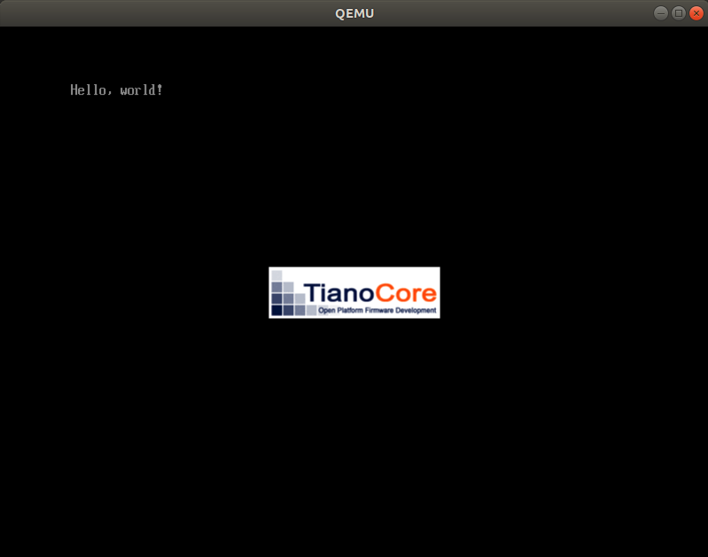
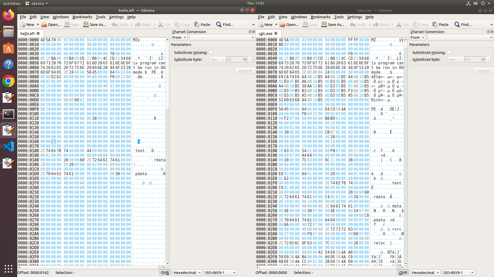

# MikanOS project
## Day 1, PC의 구조와 Hello World
<br>

### 주요 개발 사항
1. x86_64 + UEFI 환경에서 동작하는 Hello World 프로그램

<br>

### 핵심 동작 원리
1. Basic Input Output System
   - CPU는 스토리지(서브)를 읽어서 메모리에 프로그램을 적재하는 능력이 없음
   - 컴퓨터 내부를 초기화하고 부트로더를 스토리지로부터 읽어서 메모리에 적재하는 기능을 BIOS가 담당
   - UEFI BIOS란, 통합 확장 펌웨어 인터페이스 표준사양에 따라 제작된 BIOS


<br>

2. UEFI Application
   - Hello World를 화면에 출력하는 C프로그램(`hello.c`)을 컴파일하여 `hello.o`를 생성
     - 이때, `-target x86_64-pc-win32-coff`를 지정하여 COFF(common object file format)형식의 파일 생성
     - ELF(executable & linkable format)가 아니라 PE(portable executable)파일을 빌드하기 위한 과정으로 COFF를 사용함
     - ~~인텔이 개발한 EFI의 관행과 데이터 포맷 중 일부를 마이크로소프트 윈도우의 것과 동일하게 사용되는데, 실행파일의 형식이 그 중 하나일 것으로 추측~~
   - COFF형식의 `hello.o`를 링킹하여 `hello.efi`를 생성
     - 이때, `/subsystem:efi_application`을 지정하면 PE형식으로 빌드

<br>

### 주요 동작
```
$ ./devenv/run_qemu.sh hello.efi
+ [ 1 -lt 1 ]
+ dirname ./devenv/run_qemu.sh
+ DEVENV_DIR=./devenv
+ EFI_FILE=hello.efi
+ ANOTHER_FILE=
+ DISK_IMG=./disk.img
+ MOUNT_POINT=./mnt
+ ./devenv/make_image.sh ./disk.img ./mnt hello.efi
+ [ 3 -lt 3 ]
+ dirname ./devenv/make_image.sh
+ DEVENV_DIR=./devenv
+ DISK_IMG=./disk.img
+ MOUNT_POINT=./mnt
+ EFI_FILE=hello.efi
+ ANOTHER_FILE=
+ [ ! -f hello.efi ]
+ rm -f ./disk.img
+ qemu-img create -f raw ./disk.img 200M
Formatting './disk.img', fmt=raw size=209715200
+ mkfs.fat -n MIKAN OS -s 2 -f 2 -R 32 -F 32 ./disk.img
mkfs.fat 4.1 (2017-01-24)
+ ./devenv/mount_image.sh ./disk.img ./mnt
+ [ 2 -lt 2 ]
+ dirname ./devenv/mount_image.sh
+ DEVENV_DIR=./devenv
+ DISK_IMG=./disk.img
+ MOUNT_POINT=./mnt
+ [ ! -f ./disk.img ]
+ mkdir -p ./mnt
+ sudo mount -o loop ./disk.img ./mnt
[sudo] password for isugyun: 
+ sudo mkdir -p ./mnt/EFI/BOOT
+ sudo cp hello.efi ./mnt/EFI/BOOT/BOOTX64.EFI
+ [  !=  ]
+ sleep 0.5
+ sudo umount ./mnt
+ ./devenv/run_image.sh ./disk.img
+ [ 1 -lt 1 ]
+ dirname ./devenv/run_image.sh
+ DEVENV_DIR=./devenv
+ DISK_IMG=./disk.img
+ [ ! -f ./disk.img ]
+ qemu-system-x86_64 -m 1G -drive if=pflash,format=raw,readonly,file=./devenv/OVMF_CODE.fd -drive if=pflash,format=raw,file=./devenv/OVMF_VARS.fd -hda ./disk.img
WARNING: Image format was not specified for './disk.img' and probing guessed raw.
         Automatically detecting the format is dangerous for raw images, write operations on block 0 will be restricted.
         Specify the 'raw' format explicitly to remove the restrictions.
qemu-system-x86_64: warning: TCG doesn't support requested feature: CPUID.01H:ECX.vmx [bit 5]

```



<br>

### 실험실
EFI Application이 PE라면, 윈도우 실행파일과 비슷하게 생겼을까? 



좌측이 `hello.efi`이고 우측은 윈도우의 계산기 프로그램인 `calc.exe`이다. PE포맷에서 발견할 수 있는 특징은 아래와 같고, 이는 양측에서 발견할 수 있다.

- 첫 2bytes에서 `IMAGE_DOS_HEADER.e_magic`값을 가지며, "MZ"라는 DOS signature를 확인할 수 있었다. (DOS executable를 설계한 Mark Zbikowski의 이니셜)
- `IMAGE_NT_HEADERS`를 가지며, 처음 2bytes에서 "PE"를 가진다.
  - `hello.efi`의 0x78~0x79
  - `calc.exe`의 0xF0~0xF1

