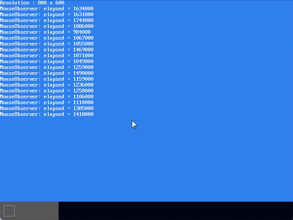

# MikanOS project
## Day 9C, 중첩처리 고속화
<br>

### 주요 개발 사항
1. shadow buffer의 개념을 도입하여 `PixelWriter::Write`의 호출을 억제

<br>

### 핵심 동작 원리
1. 렌더링 flow의 복잡성을 줄이기 위해 shadow buffer 도입
   - 이전까지의 화면 갱신은 아래 flow를 통해 일어남
     - UI요소의 데이터가 바뀜, `MouseObserver()`, `Console::PutString()`
       - 상기 UI요소를 내포하는 `Window::data_`가 변경됨
     - 화면 갱신을 위해 상기 함수가 `LayerManager::Draw()` 호출
     - 레이어 스택을 하위에서부터 상위까지 순회하며 `Layer::DrawTo()` 호출
       - 이 때, `LayerManager`가 가지고 있는 `PixelWriter`를 전달
       - 이 `PixelWriter`는 `main` 초기 `FrameBufferConfig`를 통해 초기화 된 전역 값
     - `Layer::DrawTo()`는 `Window::DrawTo()`를 호출
     - `Window::data_`값에 대응되는 픽셀을 `LayerManager`로부터 넘겨받은 `PixelWriter::Write()`로 값을 씀
   - 결국 `PixelWriter::Write()`가 모든 레이어에 대해 윈도우의 `_data` 크기만큼 호출됨
   - `_data`를 실제 프레임버퍼에 `memcpy`할 수 있다면 상당한 고속화를 이뤄낼 수 있음
     - 하지만, `_data`는 `PixelColor` 타입의 2차원 벡터임
     - `config_.frame_buffer`에 즉시 대입할 수 없음
   - 따라서 `_data`와 함께 윈도우가 자체적으로 다루는 `FrameBuffer` 즉, `Window::shadow_buffer_`를 갖게 함
   - 기존 과정에서 모든 레이어-윈도우의 이동 등의 업데이트가 `Window::shadow_buffer_`에 반영됨
   - `LayerManager::Draw()`는 `Layer::DrawTo()`에 전역 `FrameBuffer`를 전달
   - 이렇게 `Window::DrawTo()`까지 전달된 전역 `FrameBuffer`는 각 `shadow_buffer_`로부터 값을 복사받음
     - 이 과정에서 윈도우의 크기만큼 적절히 `memcpy`를 통한 복사가 일어나므로 고속화 달성

```cpp
// layer.hpp
class LayerManager {
public:
  void SetWriter(FrameBuffer* screen);
  ...

private:
  // 레이어 매니저가 전역 프레임 버퍼를 받고 이것을 하위 레이어 및 윈도우에 전달할 수 있게 함
  FrameBuffer* screen_{ nullptr };
  ...
};

// layer.cpp
void LayerManager::Draw() const {
  for (auto layer : layer_stack_) {
    layer->DrawTo(*screen_);
  }
}
...
void Layer::DrawTo(FrameBuffer &screen) const {
  if (window_) {
    window_->DrawTo(screen, pos_);
  }
}

// window.cpp
Window::Window(int width, int height, PixelFormat shadow_format)
  : width_{width}, height_{height} {
  data_.resize(height);
  for (int y = 0; y < height; ++y) {
    data_[y].resize(width);
  }

  // 윈도우가 자체적인 프레임 버퍼 즉, shadow_buffer_를 초기화
  FrameBufferConfig config{};
  config.frame_buffer = nullptr;
  config.horizontal_resolution = width;
  config.vertical_resolution = height;
  config.pixel_format = shadow_format;

  if (auto err = shadow_buffer_.Initialize(config)) {
    Log(kError, "failed to initialize shadow buffer: %s at %s:%d\n",
      err.Name(), err.File(), err.Line());
  }
}

void Window::DrawTo(FrameBuffer &dst, Vector2D<int> position) {
  // 투명 처리를 할 필요가 없으면 복사를 호출
  if (!transparent_color_) {
    dst.Copy(position, shadow_buffer_);
    return;
  }

  // 투명처리가 필요하면 FrameBufferWriter::Write로 값을 쓴다
  const auto tc = transparent_color_.value();
  auto &writer = dst.Writer();
  for (int y = 0; y < Height(); ++y) {
    for (int x = 0; x < Width(); ++x) {
      const auto c = At(Vector2D<int>{x, y});
      if (c != tc) {
        writer.Write(position + Vector2D<int>{x, y}, c);
      }
    }
  }
}

// UI가 업데이터시에 shadow_buffer_에도 값을 쓰도록 함
void Window::Write(Vector2D<int> pos, PixelColor c) {
  data_[pos.y][pos.x] = c;
  shadow_buffer_.Writer().Write(pos, c);
}

// main.cpp
// 전역 프레임 버퍼를 UEFI frame buffer config를 통해 초기화
FrameBuffer screen;
if (auto err = screen.Initialize(frame_buffer_config)) {
  Log(kError, "failed to initialize frame buffer: %s at %s:%d\n",
    err.Name(), err.File(), err.Line());
}

layer_manager = new LayerManager;
layer_manager->SetWriter(&screen);
```



<br>

### 추가
저자는 이 파트에서 `graphics`에서 정의된 `Vector2D`를 `PixelWriter`와 그 외 다양한 곳에서 사용하도록 리팩토링 하였다. 따라서 이 커밋에도 해당 변경사항이 적용되어있다. 