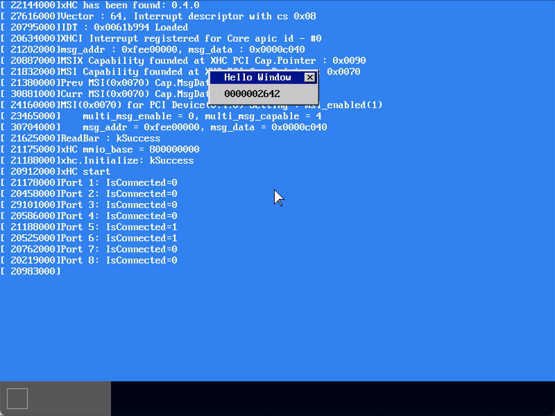
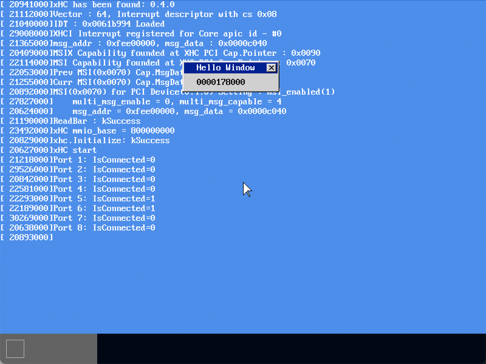

# MikanOS project
## Day 9B~E 최초의 윈도우와 깜박거림 해소(렌더링 최적화)
<br>

### 주요 개발 사항
1. 무한루프를 통해 값을 증가시키고 그것을 윈도우에 표시하는 카운터 개발
2. 카운터 값 갱신과 전체 화면의 재 렌더링이 매 루프 일어남에 따른 레이턴시 해소

<br>

### 핵심 동작 원리
1. 단순히 윈도우(제목과 닫기버튼이 있는)를 그리고 해당 영역에 카운터를 표시

```cpp
// window.cpp
void DrawWindow(PixelWriter& writer, const char* title) {
  ...
}

// main.cpp
auto main_window = std::make_shared<Window>(
  160, 52, frame_buffer_config.pixel_format
);
DrawWindow(*(main_window->Writer()), "Hello Window");
...
auto main_window_layer_id = layer_manager->NewLayer()
  .SetWindow(main_window)
  .Move({300, 100})
  .ID();
layer_manager->UpDown(main_window_layer_id, 1);

...

char str[128];
uint count = 0;

__asm__("sti");
/**
 * @brief 외부 인터럽트 이벤트 루프
 */
while (true) {
  ++count;
  sprintf(str, "%010u", count);
  FillRectangle(*(main_window->Writer()), {24, 28}, {8 * 10, 16}, {0xc6, 0xc6, 0xc6});
  WriteString(*(main_window->Writer()), {24, 28}, str, {0, 0, 0});
  layer_manager->Draw();

  __asm__("cli");
  if (main_queue.Count() == 0) {
    // __asm__("sti\n\thlt");  // HLT를 제거하여 count 값이 계속 증가하도록 함
    __asm__("sti");
    continue;
  }
  ...
}
```


```cpp
// main.cpp
while (true) {
  StartLAPICTimer();

  sprintf(str, "%010u", elapsed);
  FillRectangle(*(main_window->Writer()), {24, 28}, {8 * 10, 16}, {0xc6, 0xc6, 0xc6});
  // 타이머가 렌더링에 소요된 시간을 측정하여 표시하게 수정
  WriteString(*(main_window->Writer()), {24, 28}, str, {0, 0, 0});
  layer_manager->Draw();

  elapsed = LAPICTimerElapsed();
  StopLAPICTimer();

  __asm__("cli");
  if (main_queue.Count() == 0) {
    // __asm__("sti\n\thlt");
    __asm__("sti");
    continue;
  }
  ...
}
```


<br>

2. 카운터 값이 갱신되는 루프에서 매번 `LayerManager::Draw()` 호출로 인한 레이턴시
   - 작은 영역의 윈도우에 해당하는 업데이트에도 항상 모든 화면 영역을 그리고 있음
     - 이 업데이트가 매우 고속으로 일어나기 때문에 윈도우가 그려진지 얼마 되지 않아서 `bgwindow`로 덮어씌워짐
     - 따라서 깜빡거리는 것으로 보임
   - 이를 해소하기 위해서 `LayerManager::Draw()`를 `Layer`의 id와 영역에 해당하는 `Rectangle`을 받는 함수로 오버로딩
     - `void LayerManager::Draw(const Rectangle<int>& area) const`
       - 주어진 영역에 대해서만 그리기 수행
     - `void LayerManager::Draw(unsigned int id) const`
       - 주어진 레이어 id와 중첩되는 상위 레이어에 대해서 상기 메소드 호출
   - 하위 그리기에서도 마찬가지로 중첩 영역에 대해서만 그리기가 수행되도록 수정
   - 콘솔이 백그라운드와 분리된 자체 윈도우를 갖도록 수정
   - 이동(`LayerManager::Move`, `LayerManager::MoveRelative`)는 이동되기 전 영역에 대한 업데이트가 필요함
     - `Draw({old_pos, window_size})`을 통해 이동되기 전 영역 처리
     - `Draw(id)`으로 이동 후 영역 처리

```cpp
// layer.cpp
void LayerManager::Draw(const Rectangle<int>& area) const {
  for (auto layer : layer_stack_) {
    layer->DrawTo(*screen_, area);
  }
}

void LayerManager::Draw(unsigned int id) const {
  bool draw = false;
  Rectangle<int> window_area;
  for (auto layer : layer_stack_) {
    if (layer->ID() == id) {
      window_area.size = layer->GetWindow()->Size();
      window_area.pos = layer->GetPosition();
      draw = true;  // 이 이상의 레이어는 중첩그리기 수행
    }
    if (draw) {
      layer->DrawTo(*screen_, window_area);
    }
  }
}

void LayerManager::Move(unsigned int id, Vector2D<int> new_position) {
  auto layer = FindLayer(id);
  const auto window_size = layer->GetWindow()->Size();
  const auto old_pos = layer->GetPosition();
  layer->Move(new_position);
  Draw({old_pos, window_size});
  Draw(id);
}

void LayerManager::MoveRelative(unsigned int id, Vector2D<int> pos_diff) {
  auto layer = FindLayer(id);
  const auto window_size = layer->GetWindow()->Size();
  const auto old_pos = layer->GetPosition();
  layer->MoveRelative(pos_diff);
  Draw({old_pos, window_size});
  Draw(id);
}

// window.cpp
void Window::DrawTo(FrameBuffer &dst, Vector2D<int> position, const Rectangle<int>& area) {
  if (!transparent_color_) {
    Rectangle<int> window_area{position, this->Size()};
    Rectangle<int> intersection = area & window_area;  // 곂치는 영역(실제 업데이트가 필요한 영역)
    dst.Copy(intersection.pos, shadow_buffer_, {intersection.pos - position, intersection.size});
    return;
  }
  ...
}

// main.cpp
char str[128];
uint count = 0;

__asm__("sti");
/**
 * @brief 외부 인터럽트 이벤트 루프
 */
while (true) {
  ++count;
  sprintf(str, "%010u", count);
  FillRectangle(*(main_window->Writer()), {24, 28}, {8 * 10, 16}, {0xc6, 0xc6, 0xc6});
  WriteString(*(main_window->Writer()), {24, 28}, str, {0, 0, 0});
  layer_manager->Draw(main_window_layer_id);  // 레이어 id 전달

  __asm__("cli");
  if (main_queue.Count() == 0) {
    // __asm__("sti\n\thlt");
    __asm__("sti");
    continue;
  }
  ...
}
```


```cpp
// main.cpp
char str[128];
uint32_t elapsed = 0;

__asm__("sti");
/**
 * @brief 외부 인터럽트 이벤트 루프
 */
while (true) {
  StartLAPICTimer();

  sprintf(str, "%010u", elapsed);  // 이전보다 약 7배 고속화되었음
  FillRectangle(*(main_window->Writer()), {24, 28}, {8 * 10, 16}, {0xc6, 0xc6, 0xc6});
  WriteString(*(main_window->Writer()), {24, 28}, str, {0, 0, 0});
  layer_manager->Draw(main_window_layer_id);

  elapsed = LAPICTimerElapsed();
  StopLAPICTimer();

  __asm__("cli");
  if (main_queue.Count() == 0) {
    // __asm__("sti\n\thlt");
    __asm__("sti");
    continue;
  }
  ...
}
```


<br>

3. 고속 카운터의 영역에 마우스를 가져가보면 여전히 마우스가 깜빡이는 문제
   - 해당 영역의 마우스가 온전히 그려진 시간이 매우 짧아서 생기는 문제
     - 하위 레이어가 그려졌지만 상위 레이어가 아직 그려지지 않은 상황을 보기 때문에 깜빡이는 것
   - 백버퍼(back buffer)를 이용하여 백버퍼에 렌더링을 수행, 이후 프레임 버퍼로 백버퍼를 복사
     - 이렇게 하면 항상 온전히 그려진 중첩만을 실제 프레임 버퍼가 받기 때문에 깜빡임은 없어짐
     - 단, 백버퍼로부터 프레임버퍼까지 복사가 추가적으로 발생하기 때문에 약간 느려짐

```cpp
// layer.cpp
void LayerManager::Draw(const Rectangle<int>& area) const {
  for (auto layer : layer_stack_) {
    layer->DrawTo(back_buffer_, area);  // 백버퍼에 쓰기
  }
}

void LayerManager::Draw(unsigned int id) const {
  bool draw = false;
  Rectangle<int> window_area;
  for (auto layer : layer_stack_) {
    if (layer->ID() == id) {
      window_area.size = layer->GetWindow()->Size();
      window_area.pos = layer->GetPosition();
      draw = true;
    }
    if (draw) {
      layer->DrawTo(back_buffer_, window_area);  // 백버퍼에 쓰기
    }
  }
  // 마지막에만 프레임버퍼에 덮어쓰기
  screen_->Copy(window_area.pos, back_buffer_, window_area);
}
```




