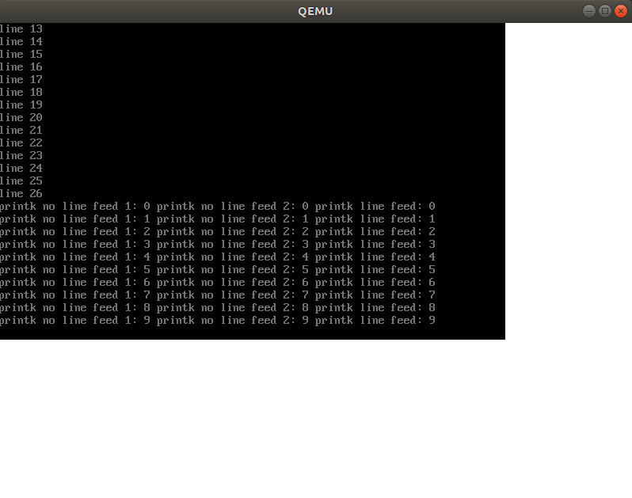

# MikanOS project
## Day 5E~F, 콘솔 클래스와 printk
<br>

### 주요 개발 사항
1. 개행 처리가 가능한 콘솔 클래스 개발
2. 서식 문자열 출력을 추상화한 `printk`함수 구현

<br>

### 핵심 동작 원리
1. 화면에 폰트를 이용해 ASCII문자열을 출력하고 `\n`를 처리하여 줄바꿈 실현
   - 콘솔에 표시할 영역의 크기를 글자 수 단위로 정의
     - `kRows = 25, kColumns = 80` 
   - 현재 콘솔에 글자를 나타낼 위치를 행과 열에 대해 정의
     - `cursor_row_, cursor_columns_`
   - 개행이 없는 문자열은 `cursor_columns_`를 증가시키며 `WriteAscii`를 통해 출력
   - 개행을 만난경우 스크롤이 필요없는 경우와 스크롤이 필요한 경우로 분기
     - `cursor_row_`가 `kRows`에 도달하기 전인 경우
       - `cursor_row_`를 증가시킴
     - `cursor_row_`가 `kRows`에 도달한 경우
       - `buffer_`를 `memcpy`로 0번째 행부터 i + 1 행을 끌어당김
       - 이후 각 행을 i번째 행으로 하여 출력함
       - 이때, `'\0'`이 필요한데, `buffer_`에 저장할 때는 `while (*s)`로 널 문자를 넣지 않음
       - `buffer_`의 모든 행의 마지막 칼럼을 한자리를 추가로 확보하고 0으로 유지하는 이유임


```cpp
...
char buffer_[kRows][kColumns + 1];
...
void Console::PutString(const char* s) {
  while (*s) {
    if (*s == '\n') {
      Newline();
    }
    else if (cursor_columns_ < kColumns - 1) {
      WriteAscii(writer_, 8 * cursor_columns_, 16 * cursor_row_, *s, fg_color_);
      buffer_[cursor_row_][cursor_columns_] = *s;
      ++cursor_columns_;
    }
    ++s;
  }
}

void Console::Newline() {
  cursor_columns_ = 0;
  if (cursor_row_ < kRows - 1) {
    ++cursor_row_;
  }
  else {
    for (int y = 0; y < 16 * kRows; ++y) {
      for (int x = 0; x < 8 * kColumns; ++x) {
        writer_.Write(x, y, bg_color_);
      }
    }
    for (int row = 0; row < kRows - 1; ++row) {
      memcpy(buffer_[row], buffer_[row + 1], kColumns + 1);
      WriteString(writer_, 0, 16 * row, buffer_[row], fg_color_);
    }
    memset(buffer_[kRows - 1], 0, kColumns + 1);
  }
}
...
```

<br>

2. 서식 문자열을 편하게 콘솔에서 출력할 수 있도록 `printk`구현
   - `vsprintf`를 활용하여 가변인자리스트 `va_list`와 `format`으로 버퍼에 문자열 세팅
   - 상기 콘솔 클래스의 메소드를 호출하여 화면에 문자열 표시

```c
int printk(const char* format, ...) {
  va_list ap;
  int result;
  char s[1024];

  va_start(ap, format);
  result = vsprintf(s, format, ap);
  va_end(ap);

  console->PutString(s);
  return result;
}
```

<br>

### 주요 동작
`Makefile`에 새로운 `console.o`를 관찰하도록 하고 커널 빌드

```make
...
OBJS = main.o graphics.o font.o cp1251/cp1251.o newlib_support.o console.o
...
```

```
$ make
```

```
$ ./devenv/run_qemu.sh ./MikanLoaderX64/DEBUG_CLANG38/X64/Loader.efi ./kernel/kernel.elf
```

