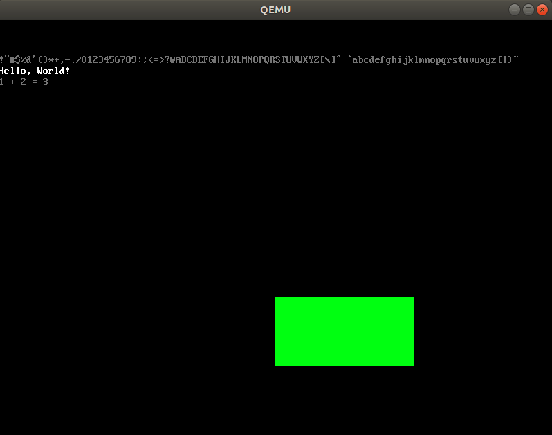

# MikanOS project
## Day 5C~D, ASCII 폰트와 문자열 출력
<br>

### 주요 개발 사항
1. ASCII 문자에 대응되는 폰트를 화면에 출력할 수 있도록 수정
2. 리터럴 문자열과 서식 지정 문자열의 출력

<br>

### 핵심 동작 원리
1. 잘 제작된 8x16 폰트 비트맵을 커널에서 사용
   - 책 원문에서는 `hankaku.txt`라는 폰트를 사용하고 있음
     - 별로 안이쁨
   - 이 프로젝트에서는 FreeBSD 12.1의 `cp1251`폰트를 사용하기로 함
     - [cp1251-8x16.fnt.psftx]([https://](https://www.zap.org.au/projects/console-fonts-distributed/psftx-freebsd-12.1/cp1251-8x16.fnt.psftx))를 파싱하여 `cp1251.txt`로 만듦
   - `tools/makefont.py`에는 위에서 만든 txt파일을 정규식으로 해석하여 비트맵을 생성하는 프로그램이 작성되어 있음
   - `tools/makefont.py`를 이용해 만든 `cp1251.bin`파일을 `objcopy`로 링크 가능한 포맷인 `cp1251.o`로 만듬
     - 이를 덤프 해보면 비트맵의 시작주소, 끝주소, 크기를 나타내는 키워드를 확인할 수 있음
       - `_binary_cp1251_cp1251_bin_start`
       - `_binary_cp1251_cp1251_bin_end`
       - `_binary_cp1251_cp1251_bin_size`
   - `font.cpp`에서 위 키워드를 사용해 특정 문자에 대한 폰트를 읽을 수 있는 `GetFont` 함수 구현
     - 각 문자가 16행, 즉 16바이트에 해당하므로 적절히 폰트 시작 주소를 계산할 수 있음
   - `GetFont`를 활용하여 ASCII 문자를 화면에 그릴 수 있도록 `WriteAscii`수정

```
...
0x41
........
........
...@....
..@@@...
.@@.@@..
@@...@@.
@@...@@.
@@@@@@@.
@@...@@.
@@...@@.
@@...@@.
@@...@@.
........
........
........
........
...
```
```make
...
cp1251.bin: cp1251/cp1251.txt
	../tools/makefont.py -o $@ $<

cp1251.o: cp1251/cp1251.o
	objcopy -I binary -O elf64-x86-64 -B i386:x86-64 $< $@
...
```
```
$ objdump -D cp1251/cp1251.o

cp1251/cp1251.o:     file format elf64-x86-64


Disassembly of section .data:

0000000000000000 <_binary_cp1251_cp1251_bin_start>:
	...
...
```
```cpp
extern const uint8_t _binary_cp1251_cp1251_bin_start;
extern const uint8_t _binary_cp1251_cp1251_bin_end;
extern const uint8_t _binary_cp1251_cp1251_bin_size;

const uint8_t* GetFont(char c) {
  auto index = 16 * static_cast<unsigned int>(c);
  if (index >= reinterpret_cast<uintptr_t>(&_binary_cp1251_cp1251_bin_size)) {
    return nullptr;
  }
  return &_binary_cp1251_cp1251_bin_start + index;
}

void WriteAscii(PixelWriter& writer, int x, int y, char c, const PixelColor& color) {
  const uint8_t* font = GetFont(c);
  if (font == nullptr)
    return;

  for (int dy = 0; dy < 16; ++dy) {
    for (int dx = 0; dx < 8; ++dx) {
      if ((font[dy] << dx) & 0x80u) {
        writer.Write(x + dx, y + dy, color);
      }
    }
  }
}
```

<br>

2. 단순 반복문과 `Newlib C` 라이브러리를 활용하여 문자열 출력
   - 리터럴 문자열이나 `'\0'`를 포함하는 `char`어레이를 반복문으로 출력하는 `WriteString`구현
   - OS가 없는 임베디드 기기에서 사용할 수 있는 `cstdio`의 `sprintf`로 서식 문자열을 만들 수 있음
     - 내부적으로 `malloc`이나 `printf`등을 표준함수에서 분리해 사용자가 구현하도록 제공
     - 즉시 활용가능한 함수는 OS 의존성이 없다고 보지만, 엄밀하게는 `sprintf`는 `sbrk`라는 시스템 콜을 사용함
       - 이 부분은 `newlib_support.c`에서 더미로 구현

```c
// newlib_support.c
#include <sys/types.h>

caddr_t sbrk(int incr) {
    return 0;
}
```
```make
...
OBJS = main.o graphics.o font.o cp1251/cp1251.o newlib_support.o
...
CFLAGS += -O2 -Wall -g --target=x86_64-elf -ffreestanding -mno-red-zone
...
kernel.elf: $(OBJS) Makefile
	ld.lld $(LDFLAGS) $(LIBS) -o kernel.elf $(OBJS) -lc
...
%.o: %.c Makefile
	clang $(CFLAGS) $(INCS) -c $<

.%.d: %.c
	clang $(CFLAGS) $(INCS) -MM $< > $@
	$(eval OBJ = $(<:.c=.o))
	sed --in-place 's|$(notdir $(OBJ))|$(OBJ)|' $@
...
```
```cpp
int i;
char c;
for (i = 0, c = '!'; c <= '~'; ++c, ++i) {
  WriteAscii(*pixel_writer, 8 * i, 50, c, {128, 128, 128});
}
WriteString(*pixel_writer, 0, 66, "Hello, World!", {255, 255, 255});

char buf[128];
sprintf(buf, "1 + 2 = %d", 1 + 2);
WriteString(*pixel_writer, 0, 82, buf, {128, 128, 128});
```

<br>

### 주요 동작
커널에 대한 변경사항을 빌드 하기 위해서 아래 명령 수행
```
$ make
```
```
$ ./devenv/run_qemu.sh ./MikanLoaderX64/DEBUG_CLANG38/X64/Loader.efi ./kernel/kernel.elf
```
폰트가 검은 배경에 회색 글씨인 모습이 너무 이뻐서 아래처럼 만들어 봄.

