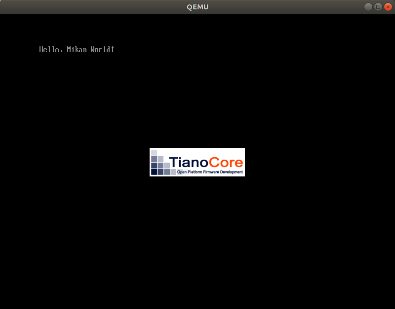

# MikanOS project
## Day 2A, EDK 입문
<br>

### 주요 개발 사항
1. EDK II를 활용해 Hello World 프로그램을 빌드

<br>

### 핵심 동작 원리
1. EDK II
   - 인텔이 구현하고 오픈소스로 공개한 것으로, UEFI BIOS와 UEFI Application의 개발에 활용
   - [mikanos-build](https://github.com/uchan-nos/mikanos-build)에서 `ansible-playbook`을 통해 EDK 환경구축
   - `~/edk2`에 clone된 환경은 `tags/edk2-stable202102`로 checkout하여 사용


<br>

1. EDK 라이브러리를 활용하여 Hello World
   - `Uefi.h`와 `Library/UefiLib.h`를 include하여 `Main.c`작성
     - 해당 헤더파일은 EDK의 기본 라이브러리인 `MdePkg`에 있음
     - IDE에서 `${HOME}/edk2/MdePkg/Include/**`를 include path로 추가하여 사용할 수 있었음
   - 부트로더로 개발할 이번 프로그램을 EDK 패키지로 구성, 자세히는 생략
     - `.dec`는 패키지에 대한 선언 
     - `.dsc`는 패키지에 대한 기술(description)
     - `.inf`는 패키지의 컴포넌트에 대한 정의
       - `ENTRY_POINT=UefiMain`을 통해 프로그램의 진입점을 정의할 수 있다

<br>

### 주요 동작
`devenv/loader_edkbuild.sh`는 `MikanLoaderPkg`를 EDK 환경에 복사하고 `edksetup.sh`를 통해 환경변수 설정, `build`명령을 통해 EFI를 최종적으로 빌드하는 과정을 실행한다.

책과 [mikanos-build](https://github.com/uchan-nos/mikanos-build)에서 설명하는 방법을 따르면 아래와 같은 에러가 발생하는데 이를 해결하기 위해 EDK 환경에서 `git checkout`으로 버전을 맞춰주는 것이 포함되어 있다.

```
$ ./devenv/loader_edkbuild.sh ./MikanLoaderPkg/ ./
...중략
- Done -
Build end time: 15:28:20, Jul.28 2022
Build total time: 00:00:01
```

이후 생성된 `MikanLoaderX64`에는 target system의 EFI가 빌드되어 있다.

```
$ tree MikanLoaderX64/
MikanLoaderX64/
└── DEBUG_CLANG38
...중략
    └── X64
        ├── Loader.debug
        ├── Loader.efi
        ├── MdePkg
...중략
53 directories, 392 files

```

이것을 아래 명령으로 QEMU에서 UEFI Application으로 로드할 수 있다.

```
$ ./devenv/run_qemu.sh ./MikanLoaderX64/DEBUG_CLANG38/X64/Loader.efi
```

