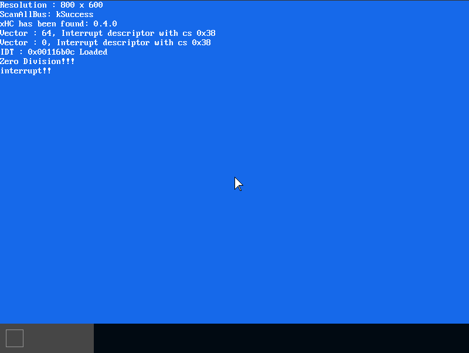
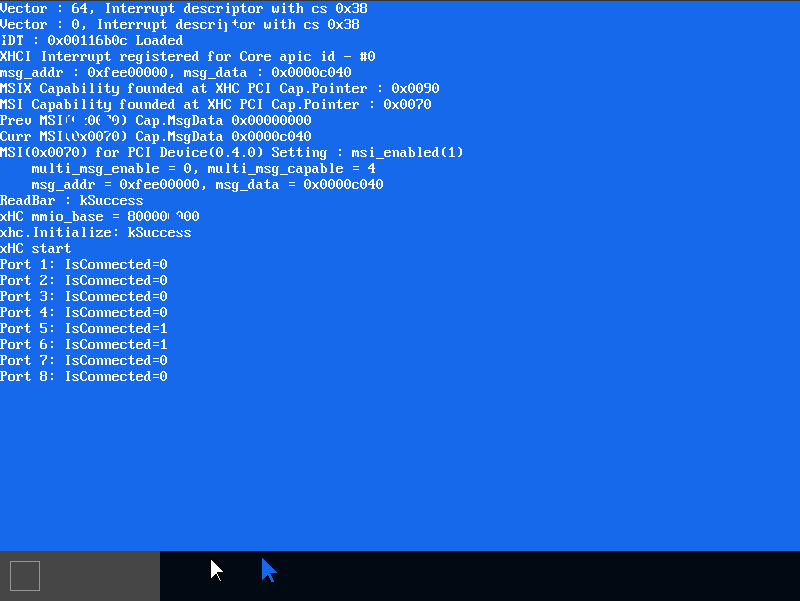

# MikanOS project
## Day 7A, IDT와 xHC 인터럽트 핸들러 개발 및 xHC PCI MSI 활성화
<br>

### 주요 개발 사항
1. 인터럽트 기술자(Interrupt Descriptor) 구조 설계
2. 인터럽트 기술자 테이블 (IDT) 설계 및 로딩 코드 작성
3. 인터럽트 핸들러 등록
4. PCI Configuration 인터페이스를 통해 xHC MSI 등록

<br>

### 핵심 동작 원리
1. 인터럽트 기술자 구조 및 테이블 설계
   - `x86-64`의 인터럽트는 인터럽트의 번호(Interrupt Vector)에 따라 `0~255`의 인덱스를 가짐
     - `0~19`는 CPU내부에서 발생하는 Exception 등이 위치함
     - `32`부터는 maskable interrupts
     - 
   - 각 인터럽트가 발생하면 해당 인덱스에 해당하는 인터럽트 설명자를 IDT에서 읽음
     - IDT는 `IDT[vector]`의 형태로 접근할 수 있는 배열 형태로 설계
     - 각 설명자는 핸들러의 주소를 담고 있는 `offset`과 `type`등을 나타내는 비트필드를 가짐
       - 총 16bytes(128bits)
       - offset은 시스템의 주소길이에 따라 `offset_middle`과 `offset_high`를 가짐
         - x86이 16 -> 32 -> 64 형태로 진화함에 따라 아래와 같은 구조를 가짐
         - 

```cpp
...
/**
 * @brief 인터럽트 기술자 속성, type으로 인터럽트와 트랩을 구분함. DPL은 인터럽트가 핸들링 되는 권한레벨
 */
union InterruptDescriptorAttribute {
  uint16_t data;
  struct {
    uint16_t interrupt_stack_table : 3;
    uint16_t : 5;
    DescriptorType type : 4;
    uint16_t : 1;
    uint16_t descriptor_privilege_level : 2;
    uint16_t present : 1;
  } __attribute__((packed)) bits;
} __attribute__((packed));  // 컴파일러의 구조체 얼라인먼트 방지

/**
 * @brief 인터럽트 기술자, 각 크기에 해당하는 비트필드로 인터럽트 속성과 핸들러 분기주소를 표현하는 16바이트 자료형
 */
struct InterruptDescriptor {
  uint16_t offset_low;
  uint16_t segment_selector;
  InterruptDescriptorAttribute attr;
  uint16_t offset_middle;
  uint32_t offset_high;
  uint32_t reserved;
} __attribute__((packed));

std::array<InterruptDescriptor, 256> idt;  // Interrupt Descriptor Table

void SetIDTEntry(
  InterruptDescriptor& desc,
  InterruptDescriptorAttribute attr,
  uint64_t offset,  // Interrupt Handler의 함수포인터
  uint16_t segment_selector
) {
  desc.attr = attr;
  desc.offset_low = offset & 0xffffu;
  desc.offset_middle = (offset >> 16) & 0xffffu;
  desc.offset_high = offset >> 32;
  desc.segment_selector = segment_selector;
}
```

<br>

2. 인터럽트 핸들러를 IDT에 등록하고 CPU의 IDTR에 커널의 IDT 정보 보고
   - 특정 Vector 값을 가지는 인터럽트의 핸들러를 IDT에 해당 벡터를 인덱스로 하는 위치의 오프셋에 작성
     - 인터럽트 핸들러는 `__attribute__((interrupt)) `를 통해 복귀코드를 자동으로 작성하도록 할 수 있음
     - 인터럽트 핸들러의 인자로 `InterruptFrame`의 포인터가 들어옴
       - 일반적인 함수 stack frame과 다르게 인터럽트 Call은 `Interrupt Stack Frame`을 가짐
       - 
   - IDT의 정보를 CPU에 보고하기 위해서는 IDT의 `base address`와 IDT의 `limit`이 필요함
     - 
     -  총 10bytes(80bits)에 해당하는 정보를 쓰기위해 `LoadIDT(uint16_t limit, uint64_t offset)`을 설계
        -  각각의 인자는 `RDI`와 `RSI`에 전달되게 되고, 이 값을 스택으로 복사하여 스택포인터를 `lidt` 명령의 매개변수로 전달
        -  이 과정을 거치면 코어의 `IDT`레지스터에 해당 정보가 쓰여짐

```
global LoadIDT  ; void LoadIDT(uint16_t limit, uint64_t offset);
LoadIDT:
  push rbp
  mov rbp, rsp
  sub rsp, 10
  mov [rsp], di  ; limit
  mov [rsp + 2], rsi  ; offset
  lidt [rsp]
  mov rsp, rbp
  pop rbp
  ret
```

```cpp
/**
 * @brief XHCI USB 인터럽트 핸들러
 * @param frame https://releases.llvm.org/5.0.0/tools/clang/docs/AttributeReference.html#id2
 */
__attribute__((interrupt)) 
void IntHandlerXHCI(InterruptFrame* frame) {
  while (xhc->PrimaryEventRing()->HasFront()) {
    if (auto err = ProcessEvent(*xhc)) {
      Log(kError, "Error while ProcessEvent: %s at %s:%d\n",
        err.Name(), err.File(), err.Line());
    }
  }
  NotifyEndOfInterrupt();
}

// 테스트용 인터럽트 핸들러
__attribute__((interrupt)) 
void TestHandler(InterruptFrame* frame) {
    Log(kInfo, "interrupt!!");
    while (1) {
        __asm__("hlt");
    }
    NotifyEndOfInterrupt();
}

SetIDTEntry(idt[InterruptVector::kXHCI], MakeIDTAttr(DescriptorType::kInterruptGate, 0),
  reinterpret_cast<uint64_t>(IntHandlerXHCI), cs);

SetIDTEntry(idt[0], MakeIDTAttr(DescriptorType::kInterruptGate, 0), 
  reinterpret_cast<uint64_t>(TestHandler), cs);

LoadIDT(sizeof(idt) - 1, reinterpret_cast<uint64_t>(&(idt[0])));
Log(kInfo, "IDT : 0x%08x Loaded\n", reinterpret_cast<uintptr_t>(&(idt[0])));

volatile int a = 3, b = 0;
a /= b;  // 0번 인터럽트를 발생시키는 Division Error 발생 시 TestHandler로 분기한다.
```



```
(qemu) info registers
RAX=000000000000000b RBX=000000003fea8710 RCX=0000000000116427 RDX=000000000000000a
RSI=0000000000000054 RDI=0000000080000000 RBP=000000003fea86e0 RSP=000000003fea8590
R8 =00000000001161f8 R9 =0000000000000000 R10=000000000000000c R11=000000003fea80a0
R12=0000000000116a79 R13=0000000000000000 R14=0000000000000030 R15=0000000000000038
RIP=0000000000104331 RFL=00000002 [-------] CPL=0 II=0 A20=1 SMM=0 HLT=1
ES =0030 0000000000000000 ffffffff 00cf9300 DPL=0 DS   [-WA]
CS =0038 0000000000000000 ffffffff 00af9a00 DPL=0 CS64 [-R-]
SS =0030 0000000000000000 ffffffff 00cf9300 DPL=0 DS   [-WA]
DS =0030 0000000000000000 ffffffff 00cf9300 DPL=0 DS   [-WA]
FS =0030 0000000000000000 ffffffff 00cf9300 DPL=0 DS   [-WA]
GS =0030 0000000000000000 ffffffff 00cf9300 DPL=0 DS   [-WA]
LDT=0000 0000000000000000 0000ffff 00008200 DPL=0 LDT
TR =0000 0000000000000000 0000ffff 00008b00 DPL=0 TSS64-busy
GDT=     000000003fbee698 00000047
IDT=     0000000000116b0c 00000fff  <-- IDT 주소와 (길이-1)이 등록된 모습
...

```

3. xHC 호스트 컨트롤러가 발생시킬 인터럽트에 대해 PCI MSI 등록
   - PCI 장치들이 인터럽트 신호선을 공유하고 있는 점을 극복하기 위해서 Message Signaled Interrupts(MSI)사용
     - 여기서 Message라는 것은 Trigger Mode, Level, Delivery Mode와 Vector를 포함 (Message Data)
       - 따라서, 하나의 PCI시스템에서 여러 종류의 Vector로 인터럽트를 발생시킬 수 있음
     - MSI는 메모리 I/O를 통해 인터럽트 신호를 목적 코어로 전달 시킴 (Message Address)
       - `0xfeeXXX`에 해당하는 12~31번째 비트가 목적지 코어를 나타내는 것으로 `XXX`에는 코어의 `Local APIC ID` 사용
     - 
   - 위의 구조는 하나의 `PCI Capability`이며, `MSI Capability`라고 함
     - 장치의 Capability는 Linked List처럼 탐색하며, header Capability의 포인터는 디바이스의 Configuration header에서 찾을 수 있음 (34h)
     - 
     - 
     - MSI Capability의 `ID`는 `0x05`, MSI-X는 `0x11`임

```cpp
Error ConfigureMSI(
  const Device& dev, uint32_t msg_addr, uint32_t msg_data,
  unsigned int num_vector_exponent
) {
  uint8_t cap_addr = ReadConfReg(dev, 0x34) & 0xffu;
  uint8_t msi_cap_addr = 0, msix_cap_addr = 0;
  while (cap_addr != 0) {
    auto header = ReadCapabilityHeader(dev, cap_addr);
    if (header.bits.cap_id == kCapabilityMSI) {
      Log(kInfo, "MSI Capability founded at XHC PCI Cap.Pointer : 0x%04x\n", cap_addr);
      msi_cap_addr = cap_addr;
    } 
    else if (header.bits.cap_id == kCapabilityMSIX) {
      Log(kInfo, "MSIX Capability founded at XHC PCI Cap.Pointer : 0x%04x\n", cap_addr);
      msix_cap_addr = cap_addr;
    }
    cap_addr = header.bits.next_ptr;
  }

  if (msi_cap_addr) {  // MSI 또는 MSI-X에 따라 PCI Configuration을 통해 Message Addr, Data를 등록
    return ConfigureMSIRegister(dev, msi_cap_addr, msg_addr, msg_data, num_vector_exponent);
  } else if (msix_cap_addr) {
    return ConfigureMSIXRegister(dev, msix_cap_addr, msg_addr, msg_data, num_vector_exponent);
  }
  return MAKE_ERROR(Error::kNoPCIMSI);
}

Error ConfigureMSIFixedDestination(
  const Device& dev, uint8_t apic_id,
  MSITriggerMode trigger_mode, MSIDeliveryMode delivery_mode,
  uint8_t vector, unsigned int num_vector_exponent
) {
  uint32_t msg_addr = 0xfee00000u | (apic_id << 12);  // 목적지 코어 정보
  uint32_t msg_data = (static_cast<uint32_t>(delivery_mode) << 8) | vector;
  if (trigger_mode == MSITriggerMode::kLevel) {
      msg_data |= 0xc000;
  }
  Log(kInfo, "msg_addr : 0x%08x, msg_data : 0x%08x\n", msg_addr, msg_data);
  return ConfigureMSI(dev, msg_addr, msg_data, num_vector_exponent);
}

const uint8_t bsp_local_apic_id =  // 커널 초기화를 수행하는 코어(Bootstrap Processor)의 APIC ID
  (*reinterpret_cast<const uint32_t*>(0xfee00020)) >> 24;
Log(kInfo, "XHCI Interrupt registered for Core apic id - #%d\n", bsp_local_apic_id);
auto err = pci::ConfigureMSIFixedDestination(
  *xhc_dev, bsp_local_apic_id,
  pci::MSITriggerMode::kLevel, pci::MSIDeliveryMode::kFixed,
  InterruptVector::kXHCI, 0  // XHC 인터럽트 벡터 (0x40)
);
```

<br>

### 주요 동작
새롭게 추가된 `interrupt.cpp`에 대한 컴파일 목적을 `Makefile`에 명시 후 컴파일한다.
성공적으로 커널이 부팅되고 순차적으로 인터럽트 핸들러와 벡터를 이용해 IDT를 적재하고 코어에 IDT정보를 등록한다.
이후 PCI 장치 탐색을 통해 얻은 XHC 호스트 컨트롤러 디바이스의 설정 공간 정보로부터 MSI Capability를 찾고, 인터럽트 벡터 등의 정보를 등록한다.

