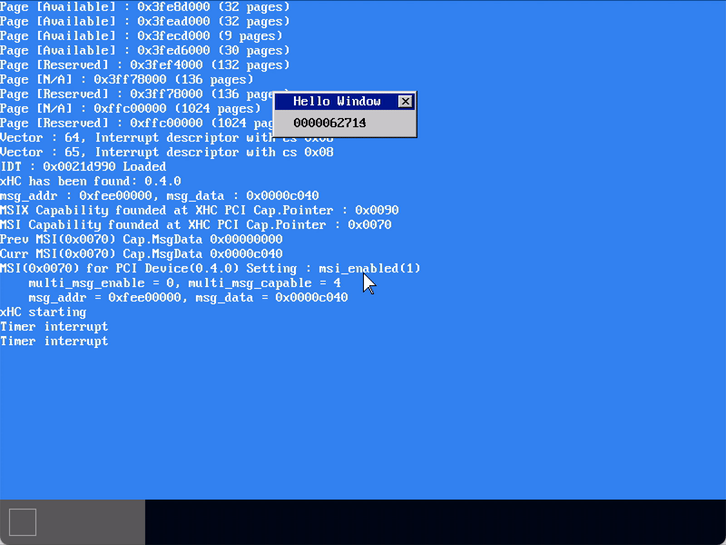
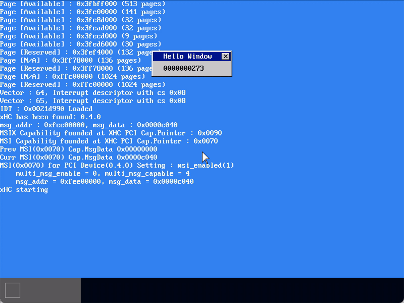
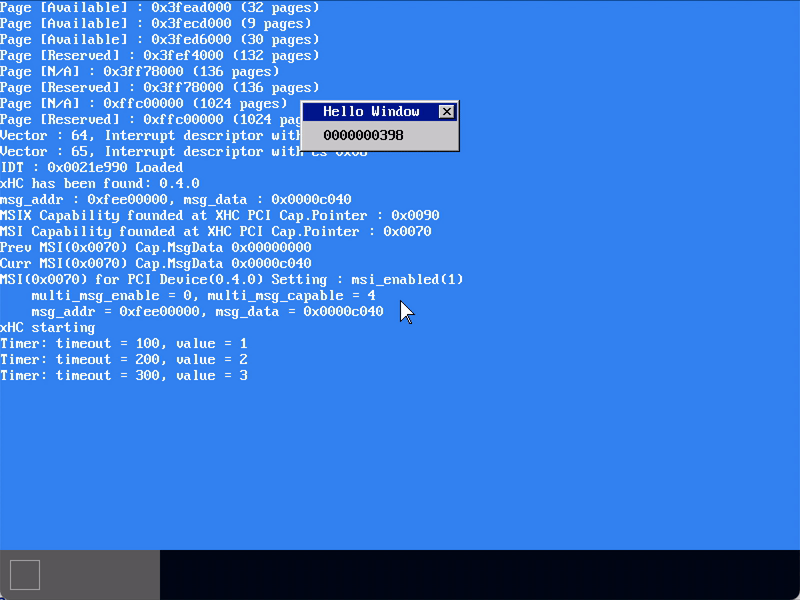

# MikanOS project
## Day 11B~D 타이머 인터럽트
<br>

### 주요 개발 사항
1. Local APIC Timer를 periodic 모드로 설정하여 일정 주기마다 타이머 인터럽트를 발생하도록 수정
2. 타이머 인터럽트를 통한 tick 발생을 관리하는 `TimerManager`를 구현
3. 여러개의 타이머를 타이머 관리자가 컨트롤

<br>

### 핵심 동작 원리
1. Local APIC Timer의 타이머 인터럽트 등록
   - `InitializeLPICTimer()`가 LVT timer 레지스터에 periodic 비트와 인터럽트 벡터를 설정
     - `lvt_timer = (0b010 << 16) | InterruptVector::kLAPICTimer`
     - 이제 이 타이머는 주기 모드로 동작하며 일정 주기마다 타이머 인터럽트를 발생시킴
   - `SetIDTEntry()`로 주어진 인터럽트 벡터에 해당하는 핸들러를 IDT에 등록
     - `kLAPICTimer`에 해당하는 인터럽트 핸들러 `IntHandlerLAPICTimer()`
     - 이벤트 큐에 `kInterruptLAPICTimer` 메세지 전달 
   - 메인 함수에서 주기적으로 발생될 출력문 지정

```cpp
// timer.cpp
void InitializeLAPICTimer() {
  divide_config = 0b1011;         // divide 1:1
  lvt_timer = (0b010 << 16) | InterruptVector::kLAPICTimer; // not-masked, periodic
  initial_count = kCountMax;
}

// interrupt.cpp
__attribute__((interrupt))
void IntHandlerLAPICTimer(InterruptFrame* frame) {
  msg_queue->push_back(Message{Message::kInterruptLAPICTimer});
  NotifyEndOfInterrupt();
}
...
SetIDTEntry(idt[InterruptVector::kLAPICTimer],
            MakeIDTAttr(DescriptorType::kInterruptGate, 0),
            reinterpret_cast<uint64_t>(IntHandlerLAPICTimer),
            kKernelCS);

// main.cpp
extern "C" void KernelMainNewStack(const FrameBufferConfig& frame_buffer_config_ref, const MemoryMap& memory_map_ref) {
  ...
  __asm__("sti");
  /**
   * @brief 외부 인터럽트 이벤트 루프
   */
  while (true) {
    ...
    switch (msg.type) {
      ...
      case Message::kInterruptLAPICTimer:
        printk("Timer interrupt\n");
        break;
      ...
    }
  }
  ...
}
```



<br>

2. 전역 타이머 관리자 구현
   - 커널 전역 객체로 타이머 관리자를 다루도록 함
   - 타이머 관리자는 타이머 인터럽트에 의해 `TimerManager::Tick()`이 호출
     - 따라서 메인 함수에서 타이머 관리자의 현재 `tick_`을 살펴보면 총 타이머 인터럽트의 발생 횟수를 알 수 있음

```cpp
// timer.hpp
class TimerManager {
public:
  void Tick();
  unsigned long CurrentTick() const { return tick_; }

private:
  volatile unsigned long tick_{0};
};

// timer.cpp
void LAPICTimerOnInterrupt() {
  timer_manager->Tick();
}

void InitializeLAPICTimer() {
  timer_manager = new TimerManager;
  ...
}

// interrupt.cpp
__attribute__((interrupt))
void IntHandlerLAPICTimer(InterruptFrame* frame) {
  LAPICTimerOnInterrupt(); // Call TimerManager::Tick()
  NotifyEndOfInterrupt();
}

// main.cpp
/**
 * @brief 외부 인터럽트 이벤트 루프
 */
while (true) {
  sprintf(str, "%010u", count);
  ...
  
  __asm__("cli");     // critical section start
  count = timer_manager->CurrentTick();  // tick에 대한 접근은 임계영역임
  
  if (main_queue->empty()) {
    __asm__("sti\n\thlt");  // 인터럽트가 발생하지 않으면 HLT 상태 유지
    continue;
  }
  
  Message msg = main_queue->front();
  main_queue->pop_front();
  __asm__("sti");     // critical section end
  ...
}
```



<br>

3. 여러개의 타이머를 타이머 관리자가 관리하도록 함
   - `Timer`객체는 timeout과 value를 갖는데, 이 중 timeout을 전역 `tick_`과 비교
   - 타이머 관리자가 특정 `Timer::timeout_`이 만료되었다는 것을 확인하면 메세지 큐로 메세지 전송

```cpp
// timer.hpp
class Timer {
  ...
  unsigned long timeout_;
  int value_;
};
...
class TimerManager {
  ...
  std::priority_queue<Timer> timers_{};
  std::deque<Message>& msg_queue_;
};

// timer.cpp
void TimerManager::Tick() {  // 타이머 인터럽트에 의해 호출됨
  ++tick_;
  while (true) {
    const auto& t = timers_.top();
    if (t.Timeout() > tick_) {  // 센티넬 값이 반드시 있어야 함
        break;
    }
    
    Message m{Message::kTimerTimeout};
    m.arg.timer.timeout = t.Timeout();
    m.arg.timer.value = t.Value();
    msg_queue_.push_back(m);  // 메세지 큐로 만료된 타이머 정보 전달
    
    timers_.pop();
  }
}

// main.cpp
...
InitializeLAPICTimer(*main_queue);

timer_manager->AddTimer(Timer(100, 1));
timer_manager->AddTimer(Timer(500, -1));
...
/**
 * @brief 외부 인터럽트 이벤트 루프
 */
while (true) {
  ...
  switch (msg.type) {
    ...
    case Message::kTimerTimeout:
      printk("Timer: timeout = %lu, value = %d\n",
      msg.arg.timer.timeout, msg.arg.timer.value);
      if (msg.arg.timer.value > 0) {
        timer_manager->AddTimer(
        Timer(msg.arg.timer.timeout + 100, msg.arg.timer.value + 1));
      }
      break;
    default:
      Log(kError, "Unknown message type: %d\n", msg.type);
  }
}
```

