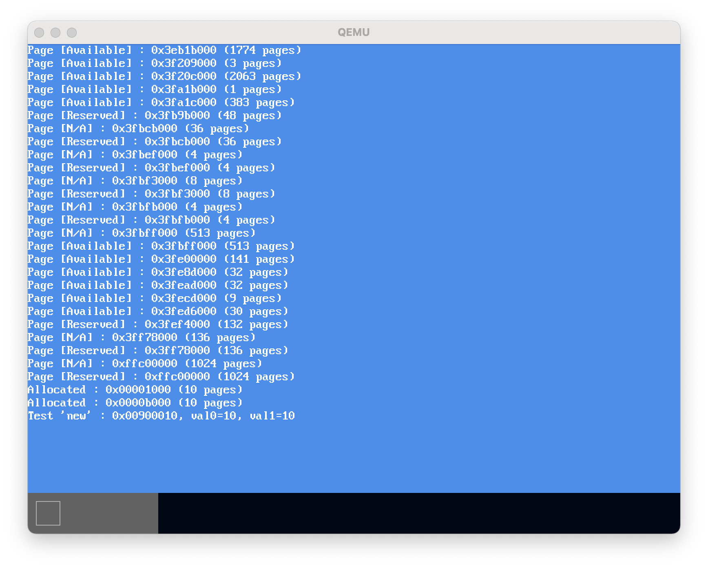
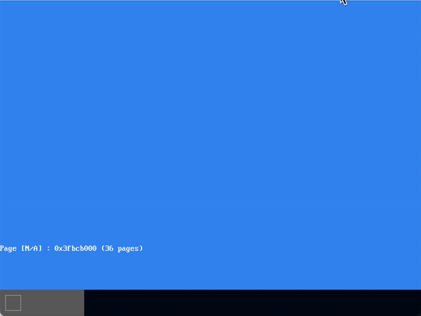

# MikanOS project
## Day 9A, new와 중첩처리 기본
<br>

### 주요 개발 사항
1. `sbrk` 구현과 `new` 연산자 사용
2. `Window`와 `Layer` 설계
3. 레이어와 윈도우로 구성된 마우스, 콘솔, 배경 구현

<br>

### 핵심 동작 원리
1. 프로그램 브레이크의 설정과 커널 힙 영역의 구성
   - 스택과 마찬가지로 힙 역시 정해진 (페이징)공간 내에서 정의됨
     - 이 때, 힙으로 사용할 공간을 정의하는 변수가 바로 **프로그램 브레이크**
       - 프로그램 브레이크는 하위 주소에서 상위 주소로 성장(스택과 경합하는 꼴)
       - 아래는 커널이 아닌 프로세스의 프로그램 브레이크(`break`)가 성장하는 예
       - 
   - 커널의 힙 영역에 대한 가용 공간은 커널 자신이 제공해야함
     - 그 이유는 커널을 관리하는 `supervisor`가 없기 때문
     - 따라서 커널은 프로그램 브레이크를 전역으로 가짐 (`program_break`)
     - 또한, 프로그램 브레이크가 최대로 성장할 수 있는 한계점도 전역으로 가짐 (`program_break_end`)
     - 힙으로 사용가능한 공간은 `program_break의 초기값` ~ `program_break_end` 임
     - 이는 메모리 관리자로부터 적절한 영역을 할당받아서 사용
   - 결국 `new`를 사용하기 위해서는 프로그램 브레이크를 초기화하고 증가시키는 것이 필요
     - `malloc()`은 `sbrk()`를 사용하여 가용 heap 영역으로부터 요청한 크기의 메모리를 반환함
       - 여기서는 Newlib의 `malloc`구현체를 사용함
       - 실제로 `malloc, free`등 은 해당 영역을 다시 **블록 단위로 구조화**하는 할당 및 해제 알고리즘 가지는 경우가 많음
         - [링크참조](https://velog.io/@seanlion/malloclab)

```cpp
// newlib_support.cpp
caddr_t program_break, program_break_end;

caddr_t sbrk(int incr) {
  // 프로그램 브레이크가 0 이거나 한계를 넘어선 경우는 에러 -1 리턴
  if (program_break == 0 || program_break + incr >= program_break_end) {
    errno = ENOMEM;
    return (caddr_t)-1;
  }

  caddr_t prev_break = program_break;
  program_break += incr;
  return prev_break;
}

// memory_manager.cpp
extern "C" caddr_t program_break, program_break_end;

Error InitializeHeap(BitmapMemoryManager& memory_manager) {
  const int kHeapFrames = 64 * 512;  // 커널 힙 영역을 128MiB로 초기화
  const auto heap_start = memory_manager.Allocate(kHeapFrames);
  if (heap_start.error) {
    return heap_start.error;
  }

  // 전역 프로그램 브레이크와 한계값을 새롭게 할당 받은 페이지로부터 계산
  program_break = reinterpret_cast<caddr_t>(heap_start.value.ID() * kBytesPerFrame);
  program_break_end = program_break + kHeapFrames * kBytesPerFrame;
  return MAKE_ERROR(Error::kSuccess);
}

// main.cpp
if (auto err = InitializeHeap(*memory_manager)) {
  Log(kError, "failed to allocate pages: %s at %s:%d\n",
    err.Name(), err.File(), err.Line());
  exit(1);
}

int* test_arr = new int[10000];
test_arr[0] = 10;
test_arr[9999] = 10;
Log(kInfo, "Test \'new\' : 0x%08x, val0=%d, val1=%d\n", test_arr, test_arr[0], test_arr[9999]);
```



<br>

2. 중첩처리를 위한 레이어-윈도우 구조 설계
   - 레이어는 여러 UI 요소의 곂침을 처리하기에 좋음
     - 하나의 레이어는 무한한 평면이며, 레이어에 윈도우가 붙어있고 화면에는 모든 레이어와 수직인 방향에서 바라본 결과를 출력
   - `PixelWriter`와 `graphics`부분을 앞으로의 호환성을 위해 재설계함
     - `PixelWriter`를 상속받는 `WindowWriter`를 설계하고 다른 코드와의 호환성을 유지하기 위함
   - `Window`클래스는 해당 윈도우 **드로잉 영역**을 2차원 벡터로 갖고 있음
     - 이 영역의 좌표는 화면(frame buffer)과의 상대적인 위치를 의미
     - 즉, 해당 윈도우의 요소가 실제로 화면에 렌더링 되는 좌표는 기준 position에 의해 결정
       - `Window`클래스의 `WindowWriter` `private` 필드는 `data_`에 상대적 그리기
       - `DrawTo`는 이 기준점과 상위 `main`에서 초기화된 `FrameBufferWriter`를 받아 렌더링 수행 가능
         - 이 때, 지정된 투명색상을 체크하여 해당 부분의 그리기를 무시할 수 있음
   - 윈도우와 대응되는 `Layer`는 윈도우를 붙여 이동시킬 수 있는 요소
   - 레이어들의 생성과 렌더링은 `LayerManager`가 담당하고 있음
     - 모든 `NewLayer`로 생성되는 레이어는 인덱스를 갖고 `layer_stack_`에 적재됨
       - 이 레이어들은 `unique_ptr`로 받아지며, 매니저의 소유권을 명확히 함
     - `LayerManager`는 각 레이어들의 위치이동과 우선순위(z-index)이동을 지원
     - `Draw`를 통해 윈도우가 부착된 모든 레이어를 하위부터 그려냄

```cpp
// window.hpp
class Window {
public:
    ...
    /** @brief 주어진 PixelWriter 에 이 윈도우의 표시 영역을 묘화 한다.
    *
    * @param writer 그리기
    * @param position writer의 좌상을 기준으로 한 드로잉 위치
    */
    void DrawTo(PixelWriter& writer, Vector2D<int> position);

    /** @brief 지정된 위치의 픽셀을 반환합니다. */
    PixelColor& At(int x, int y);
    ...

private:
    int width_, height_;
    std::vector<std::vector<PixelColor>> data_{};
    WindowWriter writer_{*this};
    std::optional<PixelColor> transparent_color_{std::nullopt};
};

// window.cpp
void Window::DrawTo(PixelWriter& writer, Vector2D<int> position) {
  if (!transparent_color_) {  // optional 값이 nullopt이면 모든 픽셀을 그림
    for (int y = 0; y < Height(); ++y) {
      for (int x = 0; x < Width(); ++x) {
        writer.Write(position.x + x, position.y + y, At(x, y));
      }
    }
    return;
  }

  const auto tc = transparent_color_.value();
  for (int y = 0; y < Height(); ++y) {
    for (int x = 0; x < Width(); ++x) {
      const auto c = At(x, y);
      if (c != tc) {  // 해당 픽셀이 배경(투명)에 해당하는 색이면 그리지 않음
        writer.Write(position.x + x, position.y + y, c);
      }
    }
  }
}

// layer.hpp
class Layer {
public:
  ...
  /** @brief 창을 설정합니다. 기존 창은 이 레이어에서 벗어난다. */
  Layer& SetWindow(const std::shared_ptr<Window>& window);
  /** @brief 설정된 창을 반환합니다. */
  std::shared_ptr<Window> GetWindow() const;

  /** @brief 레이어의 위치 정보를 지정된 절대 좌표로 업데이트합니다. 다시 그리지는 않습니다. */
  Layer& Move(Vector2D<int> pos);
  /** @brief 레이어의 위치 정보를 지정된 상대 좌표로 업데이트합니다. 다시 그리지는 않습니다. */
  Layer& MoveRelative(Vector2D<int> pos_diff);

  /** @brief writer 에 현재 설정되어 있는 윈도우의 내용을 렌더링 한다. */
  void DrawTo(PixelWriter& writer) const;

private:
  unsigned int id_;
  Vector2D<int> pos_;
  std::shared_ptr<Window> window_;
};

/** @brief LayerManager는 여러 레이어를 관리합니다. */
class LayerManager {
...
private:
  PixelWriter* writer_{nullptr};
  std::vector<std::unique_ptr<Layer>> layers_{};
  std::vector<Layer*> layer_stack_{};
  unsigned int latest_id_{0};
...
};

// layer.cpp
Layer &LayerManager::NewLayer() {
  ++latest_id_;
  return *layers_.emplace_back(new Layer{latest_id_});
}

// 삽입 연산 베이스 z-index 재설정 방법
void LayerManager::UpDown(unsigned int id, int new_height) {
  if (new_height < 0) {  // 새로운 높이를 음수로 주면 감춤
    Hide(id);
    return;
  }
  if (new_height > layer_stack_.size()) {
    new_height = layer_stack_.size();
  }

  auto layer = FindLayer(id);
  auto old_pos = std::find(layer_stack_.begin(), layer_stack_.end(), layer);
  auto new_pos = layer_stack_.begin() + new_height;

  if (old_pos == layer_stack_.end()) {
    layer_stack_.insert(new_pos, layer);
    return;
  }

  if (new_pos == layer_stack_.end()) {
    --new_pos;
  }
  layer_stack_.erase(old_pos);
  layer_stack_.insert(new_pos, layer);
}
```

<br>

3. 마우스와 배경, 콘솔을 윈도우에 그리고 레이어에 붙이기
   - 마우스 관련 클래스는 제거됨, 오직 마우스를 어떤 버퍼에 그리는 함수만 있음
     - 이 함수는 `MouseObserver`로부터 호출됨
     - 즉, 추후 인터럽트를 통해 호출됨
   - 콘솔 클래스에서 `PixelWriter`를 생성 이후에 초기화 할 수 있는 `SetWriter`를 구현
     - writer가 변경되면 콘솔 버퍼에 있는 내용을 해당 writer로 다시 쓰는 작업을 함
     - `PutString`에서 문자열을 버퍼에 쓰는 작업은 이제 전역 frame buffer writer로 쓰는 작업 수행
       -  즉, `LayerManager::Draw`를 한번 호출함
   - `main`에서 두 개의 윈도우를 만들어 각각 배경과 마우스의 영역을 제공
   - 이후 전역 `layer_manager`로부터 만들어진 레이어에 각각 부착되고 우선순위를 적절히 조정

```cpp
// mouse.hpp
const PixelColor kMouseTransparentColor{0, 0, 1};

void DrawMouseCursor(PixelWriter* pixel_writer, Vector2D<int> position);

// console.cpp
void Console::PutString(const char* s) {
  ...
  if (layer_manager) {
      layer_manager->Draw();
  }
}

void Console::Refresh() {
  for (int row = 0; row < kRows; ++row) {
      WriteString(*writer_, 0, 16 * row, buffer_[row], fg_color_);
  }
}

void Console::SetWriter(PixelWriter* writer) {
  if (writer == writer_) {
    return;
  }
  writer_ = writer;
  Refresh();
}

// main.cpp
unsigned int mouse_layer_id;

void MouseObserver(int8_t displacement_x, int8_t displacement_y) {
  layer_manager->MoveRelative(mouse_layer_id, {displacement_x, displacement_y});
  layer_manager->Draw();
}

...

console->SetWriter(bgwriter);
...
auto bglayer_id = layer_manager->NewLayer()
  .SetWindow(bgwindow)
  .Move({0, 0})
  .ID();
mouse_layer_id = layer_manager->NewLayer()
  .SetWindow(mouse_window)
  .Move({kFrameWidth / 2, kFrameHeight / 2})
  .ID();

layer_manager->UpDown(bglayer_id, 0);
layer_manager->UpDown(mouse_layer_id, 1);
layer_manager->Draw();
```



<br>

### Exception
```
ld.lld: error: undefined symbol: std::exception::~exception()
>>> referenced by memory.cpp
>>>               memory.cpp.o:(std::__1::bad_weak_ptr::~bad_weak_ptr()) in archive /home/isugyun/make-os/devenv/x86_64-elf/lib/libc++.a

ld.lld: error: undefined symbol: std::exception::~exception()
>>> referenced by memory.cpp
>>>               memory.cpp.o:(std::__1::bad_weak_ptr::~bad_weak_ptr()) in archive /home/isugyun/make-os/devenv/x86_64-elf/lib/libc++.a
Makefile:40: recipe for target 'kernel.elf' failed

```

libcxx 빌드할 때 no exception 플래그로 빌드되었을텐데 무엇인가 잘못되어있다.
일단 `libcxx_support.cpp`에 아래를 구현하여 해결하였으나 추후 라이브러리를 다시 빌드 해볼 것.

```cpp
std::exception::~exception() {}
const char* std::exception::what() const noexcept {
    return "";
}
```