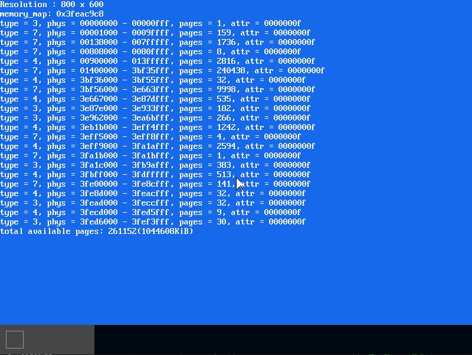

# MikanOS project
## Day 8A~B, 64비트 모드 가용 메모리 구조 정의
<br>

### 주요 개발 사항
1. 부트로더가 UEFI의 메모리 맵을 커널로 전달하도록 수정
2. 재할당 가능한 메모리에서 안전한 메모리로 스택 영역 이동
3. IA-32e 64bit 서브모드 용 세그먼트 기술자 등록 및 세그먼트 레지스터 이동
4. IA-32e 64bit 서브모드 용 페이지 테이블 등록 및 컨트롤 레지스터 설정

<br>

### 핵심 동작 원리
1. UEFI 메모리 맵을 커널로 전달
   - 부트로더가 초기에 메모리 맵을 구성하고 있음
   - 이를 커널에서 동일하게 사용하기 위해, `MemoryMap`구조체를 `memory_map.hpp`에 따로 정의
     - 이 파일은 부트로더의 `Main.c`와 커널의 `main.cpp`가 사용
       - `#ifdef __cplusplus`를 사용해 C 컴파일러가 enum 클래스나 연산자 오버로딩을 보지 못하도록 함
   - 커널 엔트리 포인트가 `MemoryMap`을 받도록 수정
   - 추후 가용 메모리 영역으로 메모리 타입이 아래와 같은 것을 확인
     - UEFI 부트 서비스 코드 영역
     - UEFI 부트 서비스 데이터 영역
     - UEFI conventinal memory 

```cpp
// memory_map.hpp
struct MemoryMap {
  unsigned long long buffer_size;
  void* buffer;
  unsigned long long map_size;
  unsigned long long map_key;
  unsigned long long descriptor_size;
  uint32_t descriptor_version;
};

// Main.c
typedef void EntryPointType(const struct FrameBufferConfig*, const struct MemoryMap*);
EntryPointType* entry_point = (EntryPointType*)entry_addr;
entry_point(&fb_config, &memmap);

// main.cpp
/**
 * @brief 커널의 엔트리포인트 
 * @param frame_buffer_config FrameBufferConfig 타입, BIOS로부터 받아온 프레임 버퍼와 그 정보 
 * @param memory_map MemoryMap 타입, UEFI로부터 받아온 메모리 맵 정보
 */
extern "C" void KernelMain(const FrameBufferConfig& frame_buffer_config, const MemoryMap& memory_map) {
  ...
  std::array<MemoryType, 3> available_memory_types{
    MemoryType::kEfiBootServicesCode,
    MemoryType::kEfiBootServicesData,
    MemoryType::kEfiConventionalMemory,
  };

  int total_avilable_pages = 0;
  Log(kInfo, "memory_map: %p\n", &memory_map);
  for (uintptr_t iter = reinterpret_cast<uintptr_t>(memory_map.buffer);
      iter < reinterpret_cast<uintptr_t>(memory_map.buffer) + memory_map.map_size;
      iter += memory_map.descriptor_size) {
    auto desc = reinterpret_cast<MemoryDescriptor*>(iter);

    for (int i = 0; i < available_memory_types.size(); ++i) {
      if (desc->type == available_memory_types[i]) 
      {
        total_avilable_pages += desc->number_of_pages;
        Log(kInfo, "type = %u, phys = %08lx - %08lx, pages = %lu, attr = %08lx\n",
            desc->type,
            desc->physical_start,
            desc->physical_start + desc->number_of_pages * 4096 - 1,
            desc->number_of_pages,
            desc->attribute);
      }
    }
  }
  Log(kInfo, "total available pages: %d(%dKiB)\n", total_avilable_pages, total_avilable_pages * 4);
  ...
}
```



<br>

2. 커널코드가 실행 되는 스택 영역의 이동
   - UEFI를 통해 커널을 로드하면, `KernelMain`의 call stack은 "UEFI 부트서비스 데이터" 영역에 올라감
   - 만약 추후 메모리관리자가 이 영역을 새로운 할당으로 제공하면 스택이 손상됨
   - 따라서, `KernelMain`이 호출 된 이후 안전한 영역의 새로운 스택을 제공해줘야 함
     - `KernelMain`이 `KernelMainNewStack`을 호출하게 함
     - `KernelMainNewStack`호출 전에는 `RSP`가 제공한 스택 `kernel_main_stack`의 끝 주소를 가르키게 함
       - 아래로 자라기 때문에 끝 주소를 제공
       - [스택 얼라인먼트](https://stackoverflow.com/questions/49391001/why-does-the-x86-64-amd64-system-v-abi-mandate-a-16-byte-stack-alignment)를 지키기 위해 `alignas(16)`으로 `kernel_main_stack`의 주소가 16의 배수에 위치하게 함

```cpp
// main.cpp
/**
 * @brief 커널 콜에 사용될 스택
 */
alignas(16) uint8_t kernel_main_stack[1024 * 1024];

/**
 * @brief 커널의 엔트리포인트 
 * @param frame_buffer_config FrameBufferConfig 타입, BIOS로부터 받아온 프레임 버퍼와 그 정보 
 * @param memory_map MemoryMap 타입, UEFI로부터 받아온 메모리 맵 정보
 */
extern "C" void KernelMainNewStack(const FrameBufferConfig& frame_buffer_config, const MemoryMap& memory_map) {
  ...
}
```
```nasm
// asmfunc.asm
extern kernel_main_stack
extern KernelMainNewStack

global KernelMain
KernelMain:
    mov rsp, kernel_main_stack + 1024 * 1024
    call KernelMainNewStack
.fin:
    hlt
    jmp .fin

```

```
변경이전:
(qemu) info registers
RAX=000000000000002a RBX=000000003fea90d0 RCX=0000000000115988 RDX=0000000000000028
RSI=0000000000000143 RDI=00000000001151f0 RBP=000000003fea8840 RSP=000000003fea87f0 <-- 스택포인터
R8 =00000000001151f8 R9 =000000000000001e R10=00000000001002bd R11=000000003fea8325
R12=0000000000000258 R13=000000000003fb20 R14=000000003feac9c8 R15=0000000000000320


변경이후:
(qemu) info registers
RAX=000000000000002a RBX=000000003fea90d0 RCX=0000000000115988 RDX=0000000000000028
RSI=0000000000000143 RDI=00000000001151f0 RBP=0000000000215bb0 RSP=0000000000215b60 <-- 스택포인터
R8 =00000000001151f8 R9 =000000000000001e R10=00000000001002bd R11=0000000000215695
R12=0000000000000258 R13=000000000003fb20 R14=000000003feac9c8 R15=0000000000000320


```

<br>

3. 세그멘테이션 설정
   - "전역 기술자 테이블, GDT"는 특히 세그먼트 기술자가 위치하는 곳임
     - 기술자의 크기 8바이트 * 기술자의 수
   - 원래는 UEFI가 설정한 세그먼트 등의 정보가 기록되어 있음
   - 스택과 마찬가지로, 이를 새로운 공간에 정의하고 CPU에 보고할 것
   - 우리의 커널은 현재 `CR0=0x80010033` 즉, 64비트 서브모드에서 동작하고 있음
     - [CPU 동작 모드와 CR0 레지스터](https://x64os.tistory.com/entry/Control-Register)
     - 이 CPU 동작 모드에서는 가상 주소를 사용하며, 이를 위해서 세그멘테이션을 설정해야함
   - 따라서 새로운 GDT에 코드 세그먼트 기술자와 데이터 세그먼트 기술자를 포함하도록 함
     - 
     - 64비트 모드에서 세그먼트의 베이스 주소와 그 리미트는 무효임
       - 원래는 `granularity=1`일 때 4KiB 단위로 64bit 주소선으로 정의되는 할 수 있는 모든 메모리 영역을 세그먼트로 지정할 수 있음
     - 세그먼트에 주어지는 (read, write, exec)역할과 권한(ring 0~3)을 정의하는데에만 사용됨
   - GDT가 정의되고 나면, `LGDT`명령을 이용해 CPU에 GDT위치와 크기를 보고
     - `LIDT`(인터럽트 기술자 테이블 로드)와 유사하게 구현
   - GDT가 로드되고 나면 세그먼트 레지스터들을 설정하여 새로운 세그먼트 속성을 참조하도록 함
     - 이 설정 코드는 새로운 GDT가 아닌, 이전 GDT의 임시 저장 값을 기준으로 실행됨 ([descriptor cache](https://wiki.osdev.org/Descriptor_Cache))
     - 세그먼트 레지스터의 설정이 완료되고 나면, CPU는 보고받은 새로운 GDT를 참조
     - 세그먼트 레지스터에는 세그먼트의 인덱스 * 8에 해당하는 오프셋이 저장
       - 이것을 GDT 베이스 주소와 더해서 해당 세그먼트의 속성 참조
       - 세그먼트 셀렉션은 16bit, 최대 0xFFFF이고 이것을 8로 나누면 GDT에 등록될 수 있는 최대 기술자의 수는 `8191 + 1`개인 것을 알 수 있음
       - 코드 세그먼트 레지스터 `CS`는 `mov`로 설정할 수 없음
         - 이 때, far return(세그먼트 간 리턴)을 이용해서 스택에서 새로운 세그먼트 인덱스를 추출해서 설정하게끔 함

```cpp
// segment.hpp
union SegmentDescriptor {
  uint64_t data;
  struct {
    uint64_t limit_low : 16;
    uint64_t base_low : 16;
    uint64_t base_middle : 8;
    DescriptorType type : 4;
    uint64_t system_segment : 1;
    uint64_t descriptor_privilege_level : 2;
    uint64_t present : 1;
    uint64_t limit_high : 4;
    uint64_t available : 1;
    uint64_t long_mode : 1;
    uint64_t default_operation_size : 1;
    uint64_t granularity : 1;
    uint64_t base_high : 8;
  } __attribute__((packed)) bits;
} __attribute__((packed));

/**
 * @brief 주어진 입력으로부터 64-bit code segment 기술자를 생성
 * @param desc SegmentDescriptor
 * @param type DescriptorType
 * @param descriptor_privilege_level 0(특권)~3(유저)
 * @param base 세그먼트 베이스(32bit)
 * @param limit 세그먼트 리미트(20bit)
 */
void SetCodeSegment(
  SegmentDescriptor& desc,
  DescriptorType type,
  unsigned int descriptor_privilege_level,
  uint32_t base,
  uint32_t limit
);

/**
 * @brief 주어진 입력으로부터 data segment 기술자를 생성
 * @param desc SegmentDescriptor
 * @param type DescriptorType
 * @param descriptor_privilege_level 0(특권)~3(유저)
 * @param base 세그먼트 베이스(32bit)
 * @param limit 세그먼트 리미트(20bit)
 */
void SetDataSegment(
  SegmentDescriptor& desc,
  DescriptorType type,
  unsigned int descriptor_privilege_level,
  uint32_t base,
  uint32_t limit
);

// segment.cpp
namespace {
    std::array<SegmentDescriptor, 3> gdt;
}
...
void SetupSegments() {
  gdt[0].data = 0;  // NULL descriptor
  SetCodeSegment(gdt[1], DescriptorType::kExecuteRead, 0, 0, 0xfffff);
  SetDataSegment(gdt[2], DescriptorType::kReadWrite, 0, 0, 0xfffff);
  LoadGDT(sizeof(gdt) - 1, reinterpret_cast<uintptr_t>(&gdt[0]));
}
// main.cpp
```
```
global LoadGDT  ; void LoadGDT(uint16_t limit, uint64_t offset);
LoadGDT:
  push rbp
  mov rbp, rsp
  sub rsp, 10
  mov [rsp], di  ; limit
  mov [rsp + 2], rsi  ; offset
  lgdt [rsp]
  mov rsp, rbp
  pop rbp
  ret

global SetCSSS  ; void SetCSSS(uint16_t cs, uint16_t ss);
SetCSSS:
  push rbp
  mov rbp, rsp
  mov ss, si
  mov rax, .next
  push rdi    ; cs    <-- return segment
  push rax    ; RIP   <-- return address (.next)
  o64 retf    ;       <-- far return
.next:
  mov rsp, rbp
  pop rbp
  ret

global SetDSAll  ; void SetDSAll(uint16_t value);
SetDSAll:
  mov ds, di
  mov es, di
  mov fs, di
  mov gs, di
  ret
```

```
변경이전:
(qemu) info registers
...
ES =0030 0000000000000000 ffffffff 00cf9300 DPL=0 DS   [-WA]
CS =0038 0000000000000000 ffffffff 00af9a00 DPL=0 CS64 [-R-]
SS =0030 0000000000000000 ffffffff 00cf9300 DPL=0 DS   [-WA]
DS =0030 0000000000000000 ffffffff 00cf9300 DPL=0 DS   [-WA]
FS =0030 0000000000000000 ffffffff 00cf9300 DPL=0 DS   [-WA]
GS =0030 0000000000000000 ffffffff 00cf9300 DPL=0 DS   [-WA]
LDT=0000 0000000000000000 0000ffff 00008200 DPL=0 LDT
TR =0000 0000000000000000 0000ffff 00008b00 DPL=0 TSS64-busy
GDT=     000000003fbee698 00000047
...

변경이후:
(qemu) info registers
...
ES =0000 0000000000000000 00000000 00000000
CS =0008 0000000000000000 ffffffff 00af9a00 DPL=0 CS64 [-R-]
SS =0010 0000000000000000 ffffffff 00cf9300 DPL=0 DS   [-WA]
DS =0000 0000000000000000 00000000 00000000
FS =0000 0000000000000000 00000000 00000000
GS =0000 0000000000000000 00000000 00000000
LDT=0000 0000000000000000 0000ffff 00008200 DPL=0 LDT
TR =0000 0000000000000000 0000ffff 00008b00 DPL=0 TSS64-busy
GDT=     0000000000216cb0 00000017
...
```

<br>

1. 페이징 설정
   - 64비트 모드 페이징은 4계층의 페이징 테이블의 참조를 거쳐 선형(논리)주소와 물리주소를 매핑하는 것
   - 선형주소는 아래 과정을 거쳐 물리주소로 매핑됨
     - 
     - 다만, 이번에는 페이지 테이블을 따로 구조화 하지않고 디렉터리를 2D-array로 하여 정의
       - 각 페이지 테이블은 물리주소 0부터 1GiB에 해당하는 영역을 identity mapping함
       - 이는 **2MiB 페이지** 총 512개를 1개 디렉터리 원소에 정의하면 사용가능한 범위
       - 총 디렉터리는 (64, 512)차원이고 64GiB 범위
       
   - `pml4_table`, `pdp_table`는 각각 8bytes * 512(4KiB)의 공간을 차지
     - `alignas`를 이용해 4KiB만큼의 간격으로 붙어있게 함
       - 해당 공간의 주소는 하위 11개 비트가 0이게 됨
       - 이 하위 11개 비트는 비트마스킹을 통해 별도 설정 가능
       - 
     - 각 참조에서 얻어지는 엔트리에는 하위 계층 테이블 또는 페이지의 포인터 베이스 주소와 설정 값이 있음
       - 페이지 디렉터리 포인터를 참조할 때 `0x003 = 0b11`을 마스킹 : R/W=1, Present=1 
       - 페이지 디렉터리를 참조할 때 `0x003 = 0b11`을 마스킹 : R/W=1, Present=1
       - 페이지를 참조할 때 `0x083 = 0b10000011`를 마스킹 : PageSize=1(2MiB page), R/W=1, Present=1
   - 원래 페이징 설정 과정
     -  `CR3`에 PML4 어드레스 설정
     -  `CR3, CR4`의 PAE(물리주소확장) 비트 on
     -  `CR0`의 PG비트 on
     -  
     -  하지만, UEFI가 이미 페이징 기능을 쓰고있고 여기서 할 일은 새로운 PML4 테이블 주소만 업데이트 하면 되므로 첫 번째 작업만 하면 됨

```cpp
// paging.hpp

/** @brief 정적으로 예약할 페이지 디렉토리 수
 * 이 상수는 SetupIdentityPageMap에서 사용됩니다.
 * 한 페이지 디렉토리에 512 개의 2MiB 페이지를 설정할 수 있으므로,
 * kPageDirectoryCount x 1GiB의 가상 주소가 매핑됩니다.
 */
const size_t kPageDirectoryCount = 64;

// paging.cpp

namespace {
  const uint64_t kPageSize4K = 4096;
  const uint64_t kPageSize2M = 512 * kPageSize4K;
  const uint64_t kPageSize1G = 512 * kPageSize2M;

  alignas(kPageSize4K) std::array<uint64_t, 512> pml4_table;
  alignas(kPageSize4K) std::array<uint64_t, 512> pdp_table;
  alignas(kPageSize4K)
    std::array<std::array<uint64_t, 512>, kPageDirectoryCount> page_directory;
}

/** @brief 가상 주소 = 물리적 주소가 되도록 페이지 테이블을 설정합니다.
 * 궁극적으로 CR3 레지스터가 올바르게 설정된 페이지 테이블을 가리킵니다.
 */
void SetupIdentityPageTable() {
  pml4_table[0] = reinterpret_cast<uint64_t>(&pdp_table[0]) | 0x003;
  for (int i_pdpt = 0; i_pdpt < page_directory.size(); ++i_pdpt) {
    pdp_table[i_pdpt] = reinterpret_cast<uint64_t>(&page_directory[i_pdpt]) | 0x003;
    for (int i_pd = 0; i_pd < 512; ++i_pd) {
      page_directory[i_pdpt][i_pd] = i_pdpt * kPageSize1G + i_pd * kPageSize2M | 0x083;
    }
  }

  SetCR3(reinterpret_cast<uint64_t>(&pml4_table[0]));
}

// asmfunc.asm
global SetCR3  ; void SetCR3(uint64_t value);
SetCR3:
  mov cr3, rdi
  ret

// main.cpp

```

```
적용 전
GDT=     0000000000216cb0 00000017
IDT=     000000003f306018 00000fff
CR0=80010033 CR2=0000000000000000 CR3=000000003fc01000 CR4=00000668

적용 후
GDT=     0000000000217af0 00000017
IDT=     000000003f306018 00000fff
CR0=80010033 CR2=0000000000000000 CR3=0000000000219000 CR4=00000668
```