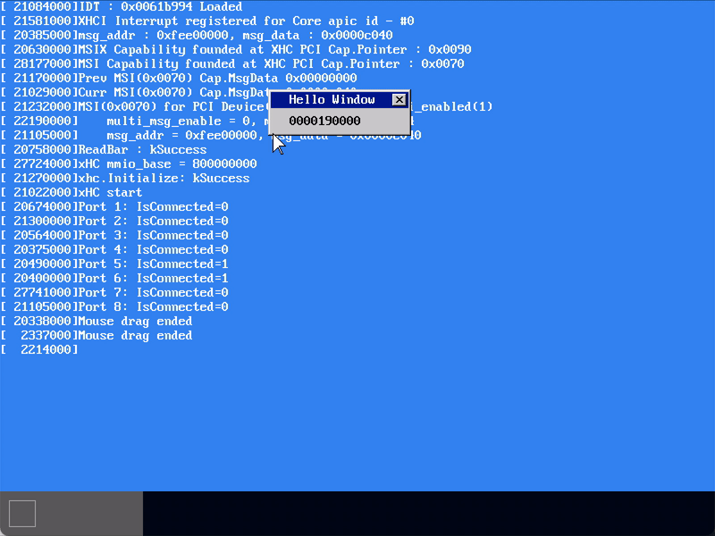

# MikanOS project
## Day 9F~G 윈도우의 드래그 이동
<br>

### 주요 개발 사항
1. `MouseObserver`가 마우스 버튼 클릭 값을 받도록 드라이버 수정
2. 마우스 위치에 따라 클릭이 발생한 위치의 레이어를 드래그 할 수 있도록 `layer` 구현 및 `MouseObserver` 수정

<br>

### 핵심 동작 원리
1. 마우스 인터럽트가 발생하면 인터럽트 핸들러에 위치정보 뿐만 아니라 버튼 정보도 함께 전달하도록 수정
   - `HIDBaseDriver::Buffer()`로부터 읽어온 배열의 첫번째 8비트는 버튼 정보를 포함
   - `uint8_t buttons = Buffer()[0]`을 `OnDataReceived`에서 받아서 `NotifyMouseMove`를 전달
   - 최종적으로 `NotifyMouseMove`가 클릭 이벤트를 인자에 포함하여 `MouseObserver`를 호출하도록 함
   - 함수 타입은 `void (uint8_t buttons, int8_t displacement_x, int8_t displacement_y)`와 같도록 수정

```cpp
// usb/classdriver/mouse.cpp
Error HIDMouseDriver::OnDataReceived() {
  uint8_t buttons = Buffer()[0];
  ...
  NotifyMouseMove(buttons, displacement_x, displacement_y);
  ...
}

void HIDMouseDriver::NotifyMouseMove(uint8_t buttons, int8_t displacement_x, int8_t displacement_y) {
  for (int i = 0; i < num_observers_; ++i) {
    observers_[i](buttons, displacement_x, displacement_y);
  }
}
```

<br>

1. 드래그 할 레이어를 지정하고 마우스가 움직인 상대 위치로 이동
   - 드래그가 가능한 레이어만을 지정하기 위해 레이어마다 `draggable_` 불리언 정보를 포함하도록 클래스 필드를 작성
   - 마우스 클릭이 발생한 시점에 현재 마우스 위치로 바로 아래에 있는 윈도우를 찾음
     - `std::find_if()`와 리버스 이터레이터를 통해 레이어 스택을 뒤에서부터 탐색
   - 만약 그러한 윈도우를 포함한 레이어가 존재하고 해당 레이어가 `draggable_`이 참인지 확인
   - 이후 호출된 `MouseObserver`는 이전 클릭상태와 현재 클릭상태를 비교해 **드래그**중인지를 판별
   - 만약 드래그 중이라면 해당 레이어를 `MoveRelative()`함

```cpp
// main.cpp
void MouseObserver(uint8_t buttons, int8_t displacement_x, int8_t displacement_y) {
  static unsigned int mouse_drag_layer_id = 0;
  static uint8_t previous_buttons = 0;

  const auto oldpos = mouse_position;
  ...
  const auto posdiff = mouse_position - oldpos;
  ...
  const bool previous_left_pressed = (previous_buttons & 0x01);  // 1번째 비트에 따라 왼쪽클릭 여부를 확인
  const bool left_pressed = (buttons & 0x01);
  if (!previous_left_pressed && left_pressed) {
    auto layer = layer_manager->FindLayerByPosition(mouse_position, mouse_layer_id);
    if (layer && layer->IsDraggable()) {  // 클릭 위치에 있는 윈도우 확인
      mouse_drag_layer_id = layer->ID();
    }
  } else if (previous_left_pressed && left_pressed) {
    if (mouse_drag_layer_id > 0) {  // 드래그 중
      layer_manager->MoveRelative(mouse_drag_layer_id, posdiff);
    }
  } else if (previous_left_pressed && !left_pressed) {  // 드래그를 놓음
    mouse_drag_layer_id = 0;
  }

  previous_buttons = buttons;
}
```

