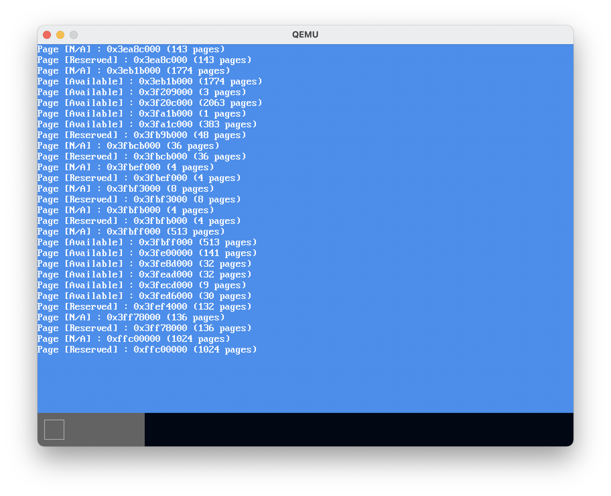
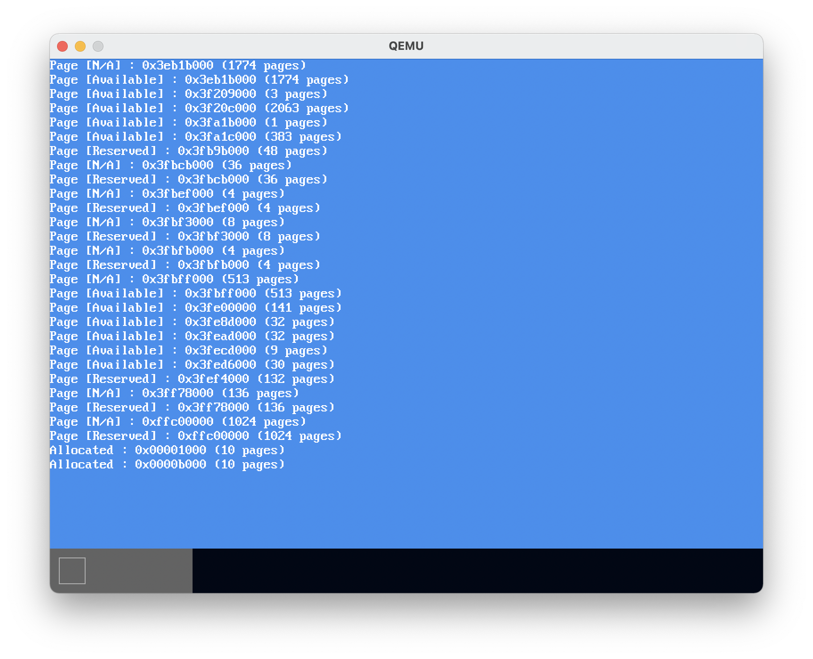

# MikanOS project
## Day 8C, 비트맵 메모리 관리자
<br>

### 주요 개발 사항
1. UEFI 메모리 맵으로부터 커널이 사용가능한 메모리를 비트단위로 관리하는 데이터 구조 설계
2. 비트맵을 활용하여 할당과 해제 메소드 구현

<br>

### 핵심 동작 원리
1. UEFI 메모리 맵을 읽어서 사용가능한 영역을 비트맵으로 표현
   - 이전 단계에서 UEFI로부터 비트맵을 받고, 사용가능한 영역을 구분하는 작업을 이미 하고 있음
     - `main.cpp`에서 하던 사용가능한 영역을 확인하는 작업을 `memory_map.hpp`의 `IsAvailable`로 정리
     - UEFI와 우리의 커널 모두 페이지를 4KiB 단위로 정의하고 있음
     - 메모리 맵 탐색을 통해 관리해야할 메모리의 총 영역을 계산할 수 있음
     - 메모리 맵에서 가져온 메모리 기술자의 `desc->physical_start`는 물리주소
       - 따라서 이 값을 4096으로 나누면 아이덴티티 매핑된 페이지의 인덱스
   - 메모리 맵에서 사용 불가능(할당이 불가능)한 영역을 이미 할당 됨(`allocated: 1bit`)로 표시
     - `alloc_map_` 배열을 비트연산을 이용해 하나의 페이지에 대한 할당 표시
       - 배열원소 1개 당 `8 * sizeof(MapLineType)`개의 비트를 가짐
       - 4KiB페이지의 상태를 1비트로 하여, 총 128GiB 영역을 표시할 수 있음
         - 배열 원소의 수 `(128GiB / 4KiB) / (8 * sizeof(MapLineType)`

```cpp
// memory_map.hpp
inline bool IsAvailable(MemoryType memory_type) {
  return
    memory_type == MemoryType::kEfiBootServicesCode ||
    memory_type == MemoryType::kEfiBootServicesData ||
    memory_type == MemoryType::kEfiConventionalMemory;
}

// memory_manager.hpp
std::array<MapLineType, kFrameCount / kBitsPerMapLine> alloc_map_; // length: (128GiB / 4KiB) / (8 * sizeof(MapLineType)

// memory_manager.cpp
bool BitmapMemoryManager::GetBit(FrameID frame) const {
  auto line_index = frame.ID() / kBitsPerMapLine;
  auto bit_index = frame.ID() % kBitsPerMapLine;

  return (alloc_map_[line_index] & (static_cast<MapLineType>(1) << bit_index)) != 0;
}

void BitmapMemoryManager::SetBit(FrameID frame, bool allocated) {
  auto line_index = frame.ID() / kBitsPerMapLine;
  auto bit_index = frame.ID() % kBitsPerMapLine;

  if (allocated) {
    alloc_map_[line_index] |= (static_cast<MapLineType>(1) << bit_index);
  } else {
    alloc_map_[line_index] &= ~(static_cast<MapLineType>(1) << bit_index);
  }
}

void BitmapMemoryManager::MarkAllocated(FrameID start_frame, size_t num_frames) {
  for (size_t i = 0; i < num_frames; ++i) {
    SetBit(FrameID{start_frame.ID() + i}, true);
  }
}

// main.cpp
::memory_manager = new(memory_manager_buf) BitmapMemoryManager;

const auto memory_map_base = reinterpret_cast<uintptr_t>(memory_map.buffer);
uintptr_t available_end = 0;
for (uintptr_t iter = memory_map_base;
      iter < memory_map_base + memory_map.map_size;
      iter += memory_map.descriptor_size) {
  auto desc = reinterpret_cast<const MemoryDescriptor*>(iter);
  if (available_end < desc->physical_start) {
    memory_manager->MarkAllocated(
      FrameID{available_end / kBytesPerFrame},
      (desc->physical_start - available_end) / kBytesPerFrame);
    Log(kInfo, "Page [N/A] : 0x%08x (%d pages)\n", desc->physical_start, desc->number_of_pages);
  }

  const auto physical_end =
    desc->physical_start + desc->number_of_pages * kUEFIPageSize;
  if (IsAvailable(static_cast<MemoryType>(desc->type))) {
    available_end = physical_end;
    Log(kInfo, "Page [Available] : 0x%08x (%d pages)\n", desc->physical_start, desc->number_of_pages);
  } else {
    memory_manager->MarkAllocated(
      FrameID{desc->physical_start / kBytesPerFrame},
      desc->number_of_pages * kUEFIPageSize / kBytesPerFrame);
    Log(kInfo, "Page [Reserved] : 0x%08x (%d pages)\n", desc->physical_start, desc->number_of_pages);
  }
}
memory_manager->SetMemoryRange(FrameID{1}, FrameID{available_end / kBytesPerFrame});
```



<br>

2. 메모리 영역의 할당 및 해제
   - 원하는 수 만큼의 페이지를 할당 하는 것은 연속된 방 번호를 가진 호텔 방을 예약하는 것으로 이해
     - 비트맵을 탐색하며 가장 먼저 요구로 하는 크기의 빈 공간을 찾아 리턴 : **First Fit**
       - 찾은 뒤에는 비트맵에서 해당 영역을 `1`로 표시
   - 해제 시에는 미리 할당 된 페이지 ID와 크기를 이용하여 비트맵의 해당 영역을 `0`으로 표시

```cpp
// mermory_manager.cpp
WithError<FrameID> BitmapMemoryManager::Allocate(size_t num_frames) {
  size_t start_frame_id = range_begin_.ID();
  while (true) {
    size_t i = 0;
    for (; i < num_frames; ++i) {
      if (start_frame_id + i >= range_end_.ID()) {
        return {kNullFrame, MAKE_ERROR(Error::kNoEnoughMemory)};
      }
      if (GetBit(FrameID{start_frame_id + i})) {
        break;
      }
    }
    if (i == num_frames) {
      MarkAllocated(FrameID{start_frame_id}, num_frames);
      return {
        FrameID{start_frame_id},
        MAKE_ERROR(Error::kSuccess),
      };
    }
    start_frame_id += i + 1;
  }
}

Error BitmapMemoryManager::Free(FrameID start_frame, size_t num_frames) {
  for (size_t i = 0; i < num_frames; ++i) {
    SetBit(FrameID{start_frame.ID() + i}, false);
  }
  return MAKE_ERROR(Error::kSuccess);
}

// main.cpp
FrameID frame_id_1 = memory_manager->Allocate(10).value;
Log(kInfo, "Allocated : 0x%08x (%d pages)\n", frame_id_1.ID() * 4_KiB, 10);
FrameID frame_id_2 = memory_manager->Allocate(10).value;
Log(kInfo, "Allocated : 0x%08x (%d pages)\n", frame_id_2.ID() * 4_KiB, 10);
```



```
0xb000 - 0x1000 = 0xA000(10 * 4096)
```