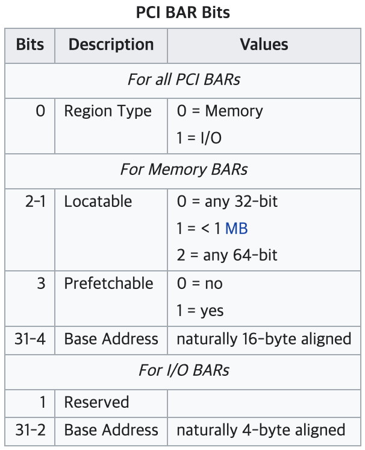
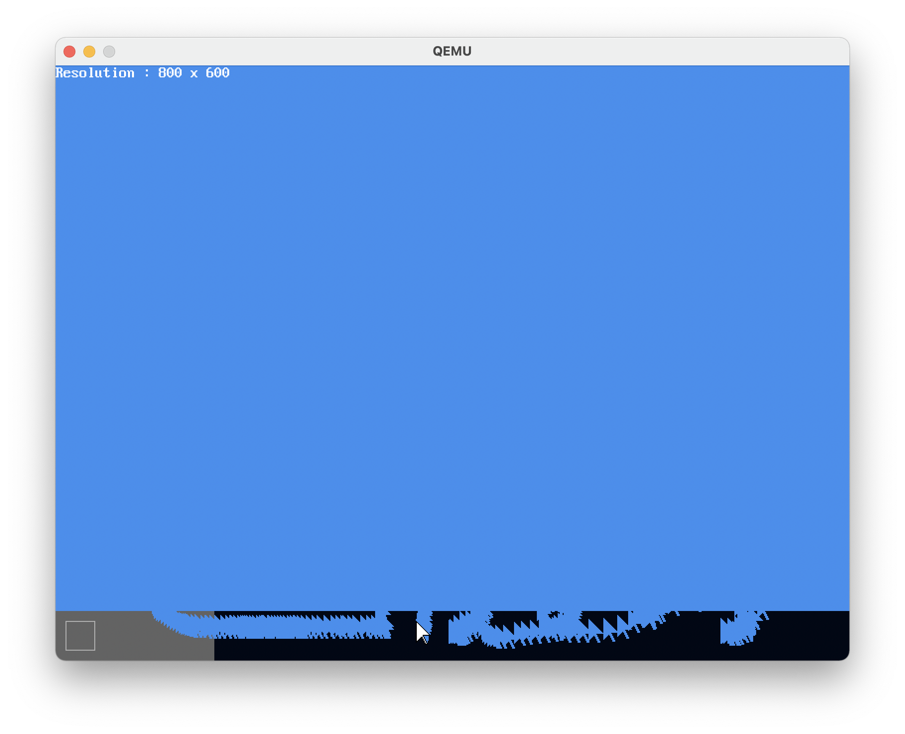

# MikanOS project
## Day 6C, xHC 초기화와 USB드라이버를 이용한 마우스 폴링
<br>

### 주요 개발 사항
1. xHC 및 USB 드라이버를 프로젝트에 추가
2. 마우스 클래스 작성
3. PCI xHC USB 3.0 호스트 컨트롤러 디바이스의 MMIO 베이스 주소 탐색
4. 찾은 xHC MMIO 베이스 주소를 이용해 xHC를 초기화
5. xHC의 포트를 순회하며 USB 장치가 연결된 포트를 구성
6. HID 마우스 옵저버(이벤트 리스너) 연결
7. xHC에 축적된 이벤트를 무한루프에서 처리하여 이벤트 폴링

<br>

### 핵심 동작 원리
1. xHC와 기타 USB 장치 드라이버와 마우스 클래스 준비
   - [저자가 준비한 장치 드라이버](https://github.com/uchan-nos/mikanos/tree/osbook_day06c/kernel/usb)를 준비
     - 여기서 `libc++`를 사용하므로 `libcxx_support.cpp`에서 몇가지 지원사항 정의
     - 특히, `new`와 `delete`부분을 주의해야함
     - `extern "C" void __cxa_pure_virtual()` 역시 `main.cpp`에 정의함
   - 마우스 커서의 화면표시와 좌표갱신을 추상화한 `MouseCursor`클래스 정의
     - 움직일 때 기존의 마우스를 배경색으로 지우고 새로 그리는 동작

```cpp
...
class MouseCursor {
public:
  MouseCursor(PixelWriter* writer, PixelColor erase_color, Vector2D<int> initial_pos);
  void MoveRelative(Vector2D<int> displacement);

private:
  PixelWriter* pixel_writer_ = nullptr;
  PixelColor erase_color_;
  Vector2D<int> position_;
};
...
void MouseCursor::MoveRelative(Vector2D<int> displacement) {
  EraseMouseCursor(pixel_writer_, position_, erase_color_);
  position_ += displacement;
  DrawMouseCursor(pixel_writer_, position_);
}
```

<br>

2. xHC 호스트 컨트롤러 디바이스와 MMIO 베이스 주소 취득
   - xHC 호스트 컨트롤러는 PCI 클래스가 `0x0cu, 0x03u, 0x30u`임
     - 이 동작을 좀 더 쉽게 사용하기 위해 `pci::ClassCode`와 `Match`메소드 정의
   - xHC의 MMIO(메모리 맵 I/O) 베이스 주소는 xHC의 PCI 설정 공간에 있는 Base Address Register(BAR)에 있음
     - MMIO 베이스 주소는 `BAR0`과 `BAR1`에 걸쳐 64비트 주소를 포함하고 있음
     - 단, 이 부분을 읽은 값 중 [0~3번 비트](https://en.wikipedia.org/wiki/PCI_configuration_space)는 플래그 값임
     - 따라서 이 하위 4개 비트를 비트마스크로 제거하여 사용
   - 찾은 xHC의 MMIO 베이스 주소를 사용하여 `usb::xhci::Controller`의 객체를 생성
     - `Initialize`메소드를 사용하여 초기화
   - 호스트 컨트롤러에 연결된 포트(`usb::xhci::Port`)를 순회하며 포트 구성



```cpp
pci::Device* xhc_dev = nullptr;

for (int i = 0; i < pci::num_device; ++i) {
  auto& dev = pci::devices[i];
  auto vendor_id = pci::ReadVendorId(dev.bus, dev.device, dev.function);

  Log(kDebug, "%d.%d.%d: vend 0x%04x, class 0x%02x 0x%02x 0x%02x, head 0x%02x\n", 
    dev.bus, dev.device, dev.function, vendor_id, dev.class_code.base, dev.class_code.sub, dev.class_code.interface, dev.header_type);

  if (dev.class_code.Match(0x0cu, 0x03u, 0x30u /* xHC class code */)) {
    xhc_dev = &dev;

    if (vendor_id == 0x8086) {
      break;
    }
  }
}

if (xhc_dev) {
  Log(kInfo, "xHC has been found: %d.%d.%d\n", xhc_dev->bus, xhc_dev->device, xhc_dev->function);
}
...
const WithError<uint64_t> xhc_bar = pci::ReadBar(*xhc_dev, 0);
const uint64_t xhc_mmio_base = xhc_bar.value & ~static_cast<uint64_t>(0xf);
usb::xhci::Controller xhc{xhc_mmio_base};
...
for (int i = 1; i <= xhc.MaxPorts(); ++i) {
  auto port = xhc.PortAt(i);
  Log(kDebug, "Port %d: IsConnected=%d\n", i, port.IsConnected());

  if (port.IsConnected()) {
    if (auto err = ConfigurePort(xhc, port)) {
      Log(kError, "failed to configure port: %s at %s:%d\n", err.Name(), err.File(), err.Line());
      continue;
    }
  }
}
...
```

3. 마우스 이벤트를 처리할 함수를 구현하고 리스너에 등록
   - 마우스 드라이버가 마우스의 x변화량과 y변화량을 감지하여 호출해주도록 설계되어 있음
     - 이에 두 인자를 받아 마우스를 움직일 수 있게하는 `MouseObserver`를 작성
     - `HIDMouseDriver::defualt_observer`를 위 함수로 등록하여 사용
   - xHC에 축적된 이벤트를 처리하는 `ProcessEvent`를 반복적으로 호출
     - 이 함수가 새로운 마우스 이벤트를 처리할 때 마다 `MouseObserver`가 호출될 것

```cpp
...
char mouse_cursur_buf[sizeof(MouseCursor)];
MouseCursor* mouse_cursor;

void MouseObserver(int8_t displacement_x, int8_t displacement_y) {
  // Log(kError, "+%d, +%d\n", displacement_x, displacement_y);
  mouse_cursor->MoveRelative({displacement_x, displacement_y});
}
...
mouse_cursor = new(mouse_cursur_buf) MouseCursor(pixel_writer, kDesktopBGColor, {kFrameWidth / 2, kFrameHeight / 2});
...
usb::HIDMouseDriver::default_observer = MouseObserver;
...
while (1) {
  if (auto err = ProcessEvent(xhc)) {
    Log(kError, "Error while ProcessEvent: %s at %s:%d\n", err.Name(), err.File(), err.Line());
  }
}
...
```

<br>

### 주요 동작
프로젝트 내에 새로운 소스 디렉토리(`usb`와 그 하위)가 생김에 따라 `Makefile`을 새로 작성했음.
이제 모든 오브젝트 파일을 커널 루트로 가져오지 않으므로, `make clean`에서 컴파일된 바이너리를 재귀적으로 정리하도록 수정.

기존에 VM 게스트 환경 + QEMU를 사용했는데, 마우스 동작이 다소 부드럽지 못하여 디버깅조차 힘든 상황이므로 호스트 PC에서 동작시킴 

마우스 동작을 확인. 다만, 이 과정은 무한루프를 통해 이벤트를 폴링(polling)하도록 하고있기 때문에
마우스의 움직임을 적용하기 위해 CPU를 100%사용하고 있음.

그리고, 우리가 지정한 배경색으로 마우스 커서를 지우기(덧칠)하기 때문에 만약 마우스 커서 아래에 그래픽요소가 있다면 
배경색으로 지워짐.

