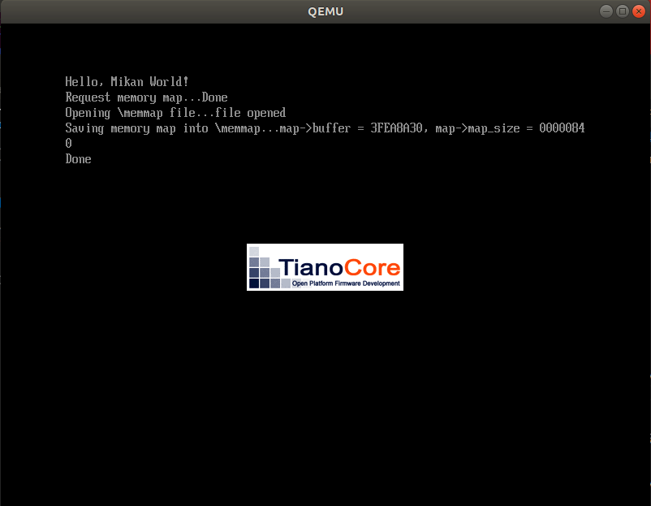

# MikanOS project
## Day 2B, 메모리 맵
<br>

### 주요 개발 사항
1. gBS 부트서비스를 이용하여 메모리 맵 취득
2. File Protocol 고수준 API를 이용하여 취득한 메모리 맵을 파일로 작성

<br>

### 핵심 동작 원리
1. gBS, Global Boot Services
   - 부트 서비스는 UEFI BIOS 펌웨어가 플랫폼(시스템?)을 소유하고 있는 동안 사용가능
   - Memory Services
     - 메모리 관리 관련 고수준 API 제공
     - `GetMemoryMap` 함수를 사용하여 해당 시점의 메모리 맵 취득
   - Open Protocol Services
     - 부트 로더, UEFI Application, Driver 등 서로다른 Binaries가 소통하는 수단이 Protocol
     - 파일 시스템에 대한 Protocol을 사용할 수 있어, 이를 활용하여 파일 입출력

```c
///
/// EFI Boot Services Table.
///
typedef struct {
  ///
  /// The table header for the EFI Boot Services Table.
  ///
...중략
  //
  // Memory Services
  //
  EFI_ALLOCATE_PAGES              AllocatePages;
  EFI_FREE_PAGES                  FreePages;
  EFI_GET_MEMORY_MAP              GetMemoryMap;
  EFI_ALLOCATE_POOL               AllocatePool;
  EFI_FREE_POOL                   FreePool;
...중략

  //
  // Open and Close Protocol Services
  //
  EFI_OPEN_PROTOCOL                 OpenProtocol;
  EFI_CLOSE_PROTOCOL                CloseProtocol;
  EFI_OPEN_PROTOCOL_INFORMATION     OpenProtocolInformation;
...중략
} EFI_BOOT_SERVICES;

extern EFI_BOOT_SERVICES  *gBS;
```

```c
...중략
gBS->OpenProtocol(
  loaded_image->DeviceHandle,
  &gEfiSimpleFileSystemProtocolGuid,
  (VOID**)&fs,  // fs를 통해 파일 입출력 가능
  image_handle,
  NULL,
  EFI_OPEN_PROTOCOL_BY_HANDLE_PROTOCOL
);
...중략
```


<br>

2. 취득한 메모리 맵을 파일 시스템 프로코톨을 통해 파일로 작성
   - 메모리 맵을 취득하면 현 시점에서 EFI가 점유하고 있는 메모리 영역에 대한 정보를 확인할 수 있음
   - `GetMemoryMap`에 의해 전달받은 `EFI_MEMORY_DESCRIPTOR`타입의 Array를 해당 타입의 size를 이용해 iteration 가능

```c
struct MemoryMap {
    UINTN buffer_size;
    VOID* buffer;  // Array
    UINTN map_size;
    UINTN map_key;
    UINTN descriptor_size;
    UINT32 descriptor_version;
};

EFI_STATUS SaveMemoryMap(struct MemoryMap* map, EFI_FILE_PROTOCOL* file) {
...중략
    int i;
    for (iter = (EFI_PHYSICAL_ADDRESS)map->buffer, i = 0;
            iter < (EFI_PHYSICAL_ADDRESS)map->buffer + map->map_size;
            iter += map->descriptor_size, ++i) {
        
        EFI_MEMORY_DESCRIPTOR* desc = (EFI_MEMORY_DESCRIPTOR*)iter;
        // 파일에 1개 라인을 쓰는 부분
        len = AsciiSPrint(buf, sizeof(buf), 
            "%u, %x, %-ls, %08lx, %lx, %lx\n", 
            i, desc->Type, GetMemoryTypeUnicode(desc->Type), 
            desc->PhysicalStart, desc->NumberOfPages, desc->Attribute & 0xffffflu);
        file->Write(file, &len, buf);
    }

    return EFI_SUCCESS;
}

...중략
// Main에서
GetMamoryMap(&memmap);

EFI_FILE_PROTOCOL* memmap_file;
root_dir->Open(
  root_dir, &memmap_file, L"\\memmap",
  EFI_FILE_MODE_READ | EFI_FILE_MODE_WRITE | EFI_FILE_MODE_CREATE, 0
);

SaveMemoryMap(&memmap, memmap_file);
```

<br>

### 주요 동작
여러가지 프로토콜에 대한 의존성을 `Loader.inf`에 명시해야한다.

```
[Protocols]
  gEfiLoadedImageProtocolGuid
  gEfiLoadFileProtocolGuid
  gEfiSimpleFileSystemProtocolGuid
  gEfiSimpleTextInProtocolGuid
```

수정된 모듈을 빌드하기 위해 아래 명령을 실행하면 메모리 맵을 읽어 파일로 작성하는 EFI Binary가 빌드된다. 

```
$ ./devenv/loader_edkbuild.sh ./MikanLoaderPkg/ ./
...중략
- Done -
Build end time: 05:23:26, Jul.31 2022
Build total time: 00:00:01
```

QEMU에서 실행하면 `Main.c`에서 작성한 몇가지 출력문이 나온다.

```
$ ./devenv/run_qemu.sh ./MikanLoaderX64/DEBUG_CLANG38/X64/Loader.efi
```



QEMU를 종료하고 `disk.img`를 Host PC에 마운트하여 `memmap`파일을 확인할 수 있다.

```
$ sudo mount -o loop disk.img mnt
$ cat mnt/memmap
Index, Type(name, PhysicalStart, NumberOfPages, Attribute
0, 3, EfiBootServicesCode, 00000000, 1, F
1, 7, EfiConventionalMemory, 00001000, 9F, F
2, 7, EfiConventionalMemory, 00100000, 700, F
3, A, EfiACPIMemoryNVS, 00800000, 8, F
4, 7, EfiConventionalMemory, 00808000, 8, F
5, A, EfiACPIMemoryNVS, 00810000, F0, F
...중략
38, 3, EfiBootServicesCode, 3FEAD000, 20, F
39, 4, EfiBootServicesData, 3FECD000, 9, F
40, 3, EfiBootServicesCode, 3FED6000, 1E, F
41, 6, EfiRuntimeServicesData, 3FEF4000, 84, F
42, A, EfiACPIMemoryNVS, 3FF78000, 88, F
43, 6, EfiRuntimeServicesData, FFC00000, 400, 1
```
