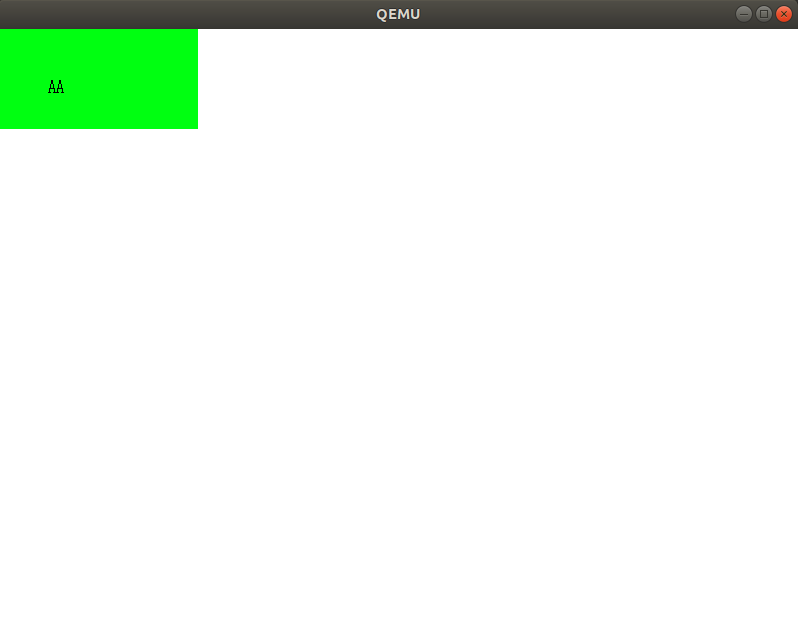

# MikanOS project
## Day 5A~B, 기본적인 폰트 출력과 분할컴파일
<br>

### 주요 개발 사항
1. 폰트 비트맵을 화면에 출력하는 방법
2. 관심사 분리와 분할 컴파일을 위한 처리

<br>

### 핵심 동작 원리
1. 8x16 비트맵 `kFontA`를 화면에 표시하기 위해 `WriteAscii`설계
   - `'A'`를 표시하기 위해서 8개의 비트, 즉 1byte에 한 줄씩 총 16줄에 걸쳐 픽셀을 그림
     - 각 줄에 해당하는 8개의 bit 중에서 값이 1인 픽셀만 `color`값을 씀

```cpp
const uint8_t kFontA[16] = {
  0b00000000, //
  0b00011000, //    **
  0b00011000, //    **
  0b00011000, //    **
  0b00011000, //    **
  0b00100100, //   *  *
  0b00100100, //   *  *
  0b00100100, //   *  *
  0b00100100, //   *  *
  0b01111110, //  ******
  0b01000010, //  *    *
  0b01000010, //  *    *
  0b01000010, //  *    *
  0b11100111, // ***  ***
  0b00000000, //
  0b00000000, //
};

void WriteAscii(PixelWriter& writer, int x, int y, char c, const PixelColor& color) {
  if (c != 'A') {
    return;
  }
  for (int dy = 0; dy < 16; ++dy) {
    for (int dx = 0; dx < 8; ++dx) {
      if ((kFontA[dy] << dx) & 0x80u) {
        writer.Write(x + dx, y + dy, color);
      }
    }
  }
}
...
// 메인에서
WriteAscii(*pixel_writer, 50, 50, 'A', {0, 0, 0});
WriteAscii(*pixel_writer, 58, 50, 'A', {0, 0, 0});
```

<br>

2. 함수와 클래스 및 메소드를 프로토타입과 바디로 각각 `*.hpp`, `*.cpp`로 분리
   - `make`가 변경된 파일에 한해서만 새롭게 컴파일하기 때문에 빌드 성능 개선
   - 관심사 분리 효과로 코드의 가독성과 개발 편의성 증가


```
$ tree kernel
kernel
├── elf.hpp
├── font.cpp
├── font.hpp
├── frame_buffer_config.hpp
├── graphics.cpp
├── graphics.hpp
├── kernel.elf
├── main.cpp
└── Makefile

```
```
...
OBJS = main.o graphics.o font.o
DEPENDS = $(join $(dir $(OBJS)),$(addprefix .,$(notdir $(OBJS:.o=.d))))
...
.%.d: %.cpp
	clang++ $(CXXFLAGS) $(INCS) -MM $< > $@
	$(eval OBJ = $(<:.cpp=.o))
	sed --in-place 's|$(notdir $(OBJ))|$(OBJ)|' $@

.PHONY: depends
depends:
	$(MAKE) $(DEPENDS)

-include $(DEPENDS)
```
<br>

### 주요 동작
커널에 대한 변경사항을 빌드 하기 위해서 아래 명령 수행
```
$ make
clang++ -nostdlibinc -D__ELF__ -D_LDBL_EQ_DBL -D_GNU_SOURCE -D_POSIX_TIMERS -DEFIAPI='__attribute__((ms_abi))' -O2 -Wall -g --target=x86_64-elf -ffreestanding -mno-red-zone -fno-exceptions -fno-rtti -std=c++17 -I/home/isugyun/make-os/devenv/x86_64-elf/include/c++/v1 -I/home/isugyun/make-os/devenv/x86_64-elf/include -I/home/isugyun/make-os/devenv/x86_64-elf/include/freetype2 -I/home/isugyun/edk2/MdePkg/Include -I/home/isugyun/edk2/MdePkg/Include/X64 -c main.cpp
clang++ -nostdlibinc -D__ELF__ -D_LDBL_EQ_DBL -D_GNU_SOURCE -D_POSIX_TIMERS -DEFIAPI='__attribute__((ms_abi))' -O2 -Wall -g --target=x86_64-elf -ffreestanding -mno-red-zone -fno-exceptions -fno-rtti -std=c++17 -I/home/isugyun/make-os/devenv/x86_64-elf/include/c++/v1 -I/home/isugyun/make-os/devenv/x86_64-elf/include -I/home/isugyun/make-os/devenv/x86_64-elf/include/freetype2 -I/home/isugyun/edk2/MdePkg/Include -I/home/isugyun/edk2/MdePkg/Include/X64 -c graphics.cpp
clang++ -nostdlibinc -D__ELF__ -D_LDBL_EQ_DBL -D_GNU_SOURCE -D_POSIX_TIMERS -DEFIAPI='__attribute__((ms_abi))' -O2 -Wall -g --target=x86_64-elf -ffreestanding -mno-red-zone -fno-exceptions -fno-rtti -std=c++17 -I/home/isugyun/make-os/devenv/x86_64-elf/include/c++/v1 -I/home/isugyun/make-os/devenv/x86_64-elf/include -I/home/isugyun/make-os/devenv/x86_64-elf/include/freetype2 -I/home/isugyun/edk2/MdePkg/Include -I/home/isugyun/edk2/MdePkg/Include/X64 -c font.cpp
ld.lld --entry KernelMain -z norelro --image-base 0x100000 --static -L/home/isugyun/make-os/devenv/x86_64-elf/lib -o kernel.elf main.o graphics.o font.o

```

```
$ ./devenv/run_qemu.sh ./MikanLoaderX64/DEBUG_CLANG38/X64/Loader.efi ./kernel/kernel.elf
```

