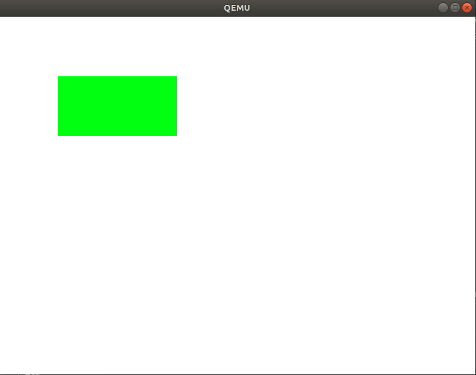

# MikanOS project
## Day 4A~B, Make와 픽셀 그리기 입문
<br>

### 주요 개발 사항
1. 커널이 프레임 버퍼에 대한 정보를 구조체로 받아오도록 수정
2. 커널 픽셀을 표현하는 순서가 RGB 또는 BGR일 때, 각각 1개의 픽셀을 그리는 함수작성
3. 부트로더가 커널을 호출할 때 프레임 버퍼에 대한 정보를 담은 구조체를 전달하도록 수정
4. 커널 빌드를 make를 사용하여 자동화

<br>

### 핵심 동작 원리
1. 픽셀 표현방법
   - UEFI GOP로부터 가능한 픽셀의 표현방법(pixel format)은 여러가지가 있음
     - `PixelBitMask`와 `PixelBltOnly`는 다루지 않음
     - `PixelRedGreenBlueReserved8bitPerColor`와 `PixelBlueGreenRedReserved8bitPerColor`는 각 픽셀이 4bytes를 점유 
       - `R(8bits)-G(8bits)-B(8bits)-Res(8bits)` 32bits = 1byte
       - `B(8bits)-G(8bits)-R(8bits)-Res(8bits)` 32bits = 1byte
   - 픽셀 표현방법에 따라 분기하여 픽셀을 그리는 함수 `WritePixel`를 구성가능
     - 디스플레이의 rows와 cols를 이용해 byte array에서 해당 픽셀의 원소특정(`pixel_position`)

```c
int WritePixel(const FrameBufferConfig& config, int x, int y, const PixelColor& c) {
    const int pixel_position = config.pixels_per_scan_line * y + x;
    if (config.pixel_format == kPixelRGBResv8BitPerColor) {
        uint8_t* p = &(config.frame_buffer[4 * pixel_position]);
        p[0] = c.r;
        p[1] = c.g;
        p[2] = c.b;
    }
    else if (config.pixel_format == kPixelBGRResv8BitPerColor) {
        uint8_t* p = &(config.frame_buffer[4 * pixel_position]);
        p[0] = c.b;
        p[1] = c.g;
        p[2] = c.r;
    }
    else {
        return -1;
    }
    return 0;
}
```

<br>

2. 커널이 받는 프레임 버퍼 정보를 구조체 타입 사용
   - 커널과 부트로더의 코드가 `frame_buffer_config.hpp`를 공유
   - 부트로더에서 `FrameBufferConfig`를 초기화하고 포인터 타입으로 전달
   - 포인터 타입으로 전달된 인수는 `System V AMD64 ABI Calling Convention`에 의거하여 레퍼런스 타입 인자로 받을 수 있음 (ptr arg -> ref param OK)
     - 해당 ABI를 따르는 컴파일러의 호출 규약은 첫번째로 인수 값을 `%rdi`를 통해 전달하는것으로 확인
     - `main.o`를 디스어셈블 해보면 `0x10(%rdi)`에 위치한 값을 0과 비교해보고 있음
     - `%rdi`는 `frame_buffer_config`를 담고있는 것으로 유추할 수 있음, 즉 주소값으로 전달됨
     - 이는 `FrameBufferConfig`의 `pixel_format`이며 이 값이 0이면 `kPixelRGBResv8BitPerColor`인 것
     - 다만 최적화로 인해 `WritePixel`을 호출하는 부분이 inline으로 치환된 것으로 보임
     

```
$ objdump -D main.o
...중략
0000000000000060 <KernelMain>:
  60:	55                   	push   %rbp
  61:	48 89 e5             	mov    %rsp,%rbp
  64:	83 7f 10 00          	cmpl   $0x0,0x10(%rdi)
  68:	74 5b                	je     c5 <KernelMain+0x65>
...
```

```cpp
// 커널에서
extern "C" void KernelMain(const FrameBufferConfig& frame_buffer_config) {...}
```
```c
// 부트로더에서
struct FrameBufferConfig fb_config = {
  (UINT8*)gop->Mode->FrameBufferBase,
  gop->Mode->Info->PixelsPerScanLine,
  gop->Mode->Info->HorizontalResolution,
  gop->Mode->Info->VerticalResolution,
  0
};
...중략
switch (gop->Mode->Info->PixelFormat) {
  case PixelRedGreenBlueReserved8BitPerColor:
    fb_config.pixel_format = kPixelRGBResv8BitPerColor;
    break;
  case PixelBlueGreenRedReserved8BitPerColor:
    fb_config.pixel_format = kPixelBGRResv8BitPerColor;
    break;
  default:
    Print(L"Unimplemented pixel format: %d\n", gop->Mode->Info->PixelFormat);
    Halt();
}
...중략
UINT64 entry_addr = *(UINT64*)(kernel_base_addr + 24);

typedef void EntryPointType(const struct FrameBufferConfig*);
EntryPointType* entry_point = (EntryPointType*)entry_addr;
entry_point(&fb_config);
...
```

<br>

### 주요 동작
`frame_buffer_config.hpp`는 커널과 부트로더가 공유해야하는 부분이다. 부트로더는 C로 작성되었고, 아마 C로 컴파일 될 것이기 때문에 `hpp`와 C++문법을 사용하면 안되는 것 같지만 확실하지 않아서 책의 내용을 따랐다. 물론 양측에서 호환되는 문법만이 사용되고 있다. 이것을 심볼릭 링크로 부트로더 패키지에도 포함시킨다.

```
$ ln -sf ../kernel/frame_buffer_config.hpp /home/isugyun/make-os/MikanLoaderPkg/
```

커널빌드는 이제 `Makefile`를 작성하여 자동화 하였다. include와 linkable lib path 및 컴파일, 링킹 옵션을 포함하고 있다.

```
TARGET = kernel.elf
OBJS = main.o

DEVENV_DIR = $(HOME)/make-os/devenv
EDK_DIR = $(HOME)/edk2

INCS += -I$(DEVENV_DIR)/x86_64-elf/include/c++/v1 \
	-I$(DEVENV_DIR)/x86_64-elf/include \
	-I$(DEVENV_DIR)/x86_64-elf/include/freetype2 \
	-I$(EDK_DIR)/MdePkg/Include \
	-I$(EDK_DIR)/MdePkg/Include/X64

LIBS += -L$(DEVENV_DIR)/x86_64-elf/lib

CXXFLAGS += -nostdlibinc -D__ELF__ -D_LDBL_EQ_DBL -D_GNU_SOURCE -D_POSIX_TIMERS \
	-DEFIAPI='__attribute__((ms_abi))' \
	-O2 -Wall -g --target=x86_64-elf -ffreestanding -mno-red-zone -fno-exceptions -fno-rtti -std=c++17

LDFLAGS += --entry KernelMain -z norelro --image-base 0x100000 --static

.PHONY: all
all: $(TARGET)

.PHONY: clean
clean:
		rm -rf *.o

kernel.elf: $(OBJS) Makefile
		ld.lld $(LDFLAGS) $(LIBS) -o kernel.elf $(OBJS)

%.o: %.cpp Makefile
		clang++ $(CXXFLAGS) $(INCS) -c $<

```
```
$ make
```

부트로더를 빌드하고 변경사항이 적용된 커널 바이너리를 부팅 디스크에 올려 실행한다.
```
$ ./devenv/loader_edkbuild.sh ./MikanLoaderPkg/ ./
$ ./devenv/run_qemu.sh ./MikanLoaderX64/DEBUG_CLANG38/X64/Loader.efi ./kernel/kernel.elf
```

