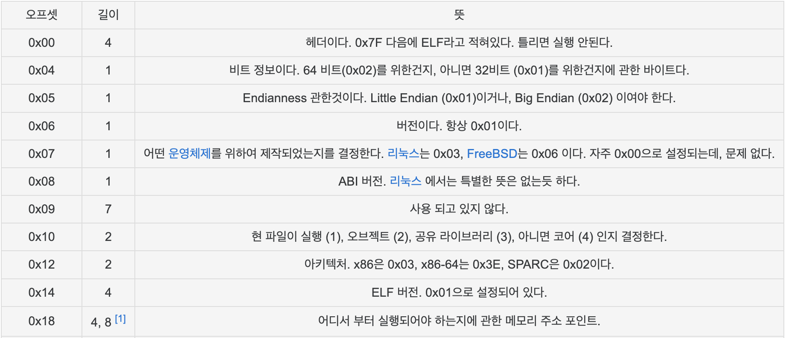
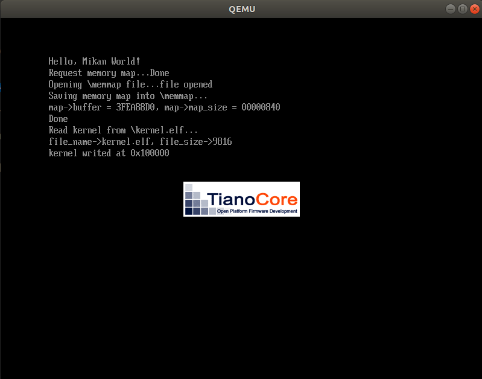

# MikanOS project
## Day 3A, 최초의 커널
<br>

### 주요 개발 사항
1. 인라인 어셈블러를 사용하여 무한루프 커널 작성 
2. 커널을 ELF로 빌드하고, 빌드된 파일을 메모리에 로드하도록 부트로더 수정
3. 부트 서비스를 종료하고 커널 엔트리 주소로 점프하도록 부트로더 수정

<br>

### 핵심 동작 원리
1. 무한루프 커널 빌드
   - `extern "C"` 키워드를 사용하여 C++ name mangling을 방지하여 함수명을 레이블로 사용
   - `__asm__("hlt")`를 무한루프 안에 배치
   - 커널 컴파일
     - 프리스탠딩 런타임 환경을 고려, `-ffreestanding`
     - OS지원이 필요한 기능을 비활성화
       - `-fno-exceptions`, `-fno-rtti`
       - `-mno-red-zone`
         - 레드존은 가장 마지막에 호출된 함수가 스택포인터를 넘어서는 부분 중 128bytes를 마치 자신의 프레임처럼 사용하게하는 최적화
         - 인터럽트가 발생하면 해당 영역은 레지스터 컨텍스트로 덮어씌어지므로 이러한 문제의 핸들링을 처리하기 전까지는 이 옵션을 비활성화
   - 커널 링킹
     - `KernelMain`을 진입점으로 설정
     - 바이너리의 베이스 주소를 `0x100000`으로 지정
       - 이는 UEFI 메모리 맵을 보고 커널이 위치할 수 있는 적절한 공간의 시작점을 의미

```c
extern "C" void KernelMain() {
    while (1) 
        __asm__("hlt");
}
```
```
$ clang++ -O2 -Wall -g --target=x86_64-elf -ffreestanding -mno-red-zone -fno-exceptions -fno-rtti -std=c++17 -c main.cpp
$ ld.lld --entry KernelMain -z norelro --image-base 0x100000 --static -o kernel.elf main.o
$ readelf -h kernel.elf
ELF Header:
  Magic:   7f 45 4c 46 02 01 01 00 00 00 00 00 00 00 00 00 
  Class:                             ELF64
  Data:                              2's complement, little endian
  Version:                           1 (current)
  OS/ABI:                            UNIX - System V
  ABI Version:                       0
  Type:                              EXEC (Executable file)
  Machine:                           Advanced Micro Devices X86-64
  Version:                           0x1
  Entry point address:               0x101000
  Start of program headers:          64 (bytes into file)
  Start of section headers:          8920 (bytes into file)
  Flags:                             0x0
  Size of this header:               64 (bytes)
  Size of program headers:           56 (bytes)
  Number of program headers:         4
  Size of section headers:           64 (bytes)
  Number of section headers:         14
  Section header string table index: 12

```

<br>

2. 커널 로드
   - 파일 시스템으로부터 `kernel.elf` 바이너리를 읽음
     - 파일 읽기는 앞서 메모리 맵 파일을 작성하는 방식을 이용
     - 읽을 위치를 약속된 `0x100000`으로 지정
     - 해당 위치에 바이너리 크기만큼의 메모리를 할당해야함
       - [UEFI Memory Allocation Service](https://edk2-docs.gitbook.io/edk-ii-uefi-driver-writer-s-guide/5_uefi_services/51_services_that_uefi_drivers_commonly_use/511_memory_allocation_services)
       - 4KiB 크기의 페이지 단위로 할당해야하므로 0x1000(4096)으로 ELF 바이너리 크기를 나눈 몫 + 나머지를 포함하는 크기를 계산하여 사용

```c
EFI_FILE_PROTOCOL* kernel_file;
root_dir->Open(
  root_dir, &kernel_file, L"\\kernel.elf",
  EFI_FILE_MODE_READ, 0
);
...중략
EFI_PHYSICAL_ADDRESS kernel_base_addr = 0x100000;
gBS->AllocatePages(
  AllocateAddress, EfiLoaderData,
  (kernel_file_size + 0xfff) / 0x1000, &kernel_base_addr
);
kernel_file->Read(kernel_file, &kernel_file_size, (VOID*)kernel_base_addr);
```

<br>

3. 부트 서비스 종료 및 커널 호출
   - 커널이 호출되기 직전과 그 이후로는 UEFI의 부트 서비스가 필요하지 않음
     - 이후로 `Print`등의 부트 서비스 API를 사용하지 않도록 해야함 
   - 커널 주소를 함수포인터로 캐스팅하여 호출
     - 이때 호출되는 주소는 ELF 헤더의 `Entry point address`에서 읽어옴
     - Base address로부터 Entry point address까지는 24bytes만큼 예약되어있음
     - 따라서 0x100000 + 0x18이 Entry point address가 있는 곳이고, 이 곳에 `KernelMain`의 주소가 있음
  


```c
EFI_STATUS status;
status = gBS->ExitBootServices(image_handle, memmap.map_key);
...중략

UINT64 entry_addr = *(UINT64*)(kernel_base_addr + 24);

typedef void EntryPointType(void);
EntryPointType* entry_point = (EntryPointType*)entry_addr;
entry_point();
```

<br>

### 주요 동작
ELF파일의 정보를 읽어오기 위한 의존성을 `Loader.inf`에 명시해야한다.

```
[Guids]
  gEfiFileInfoGuid
```

수정된 모듈을 빌드하기 위해 아래 명령을 실행하면 메모리 맵을 읽어 파일로 작성하는 EFI Binary가 빌드된다. 

```
$ ./devenv/loader_edkbuild.sh ./MikanLoaderPkg/ ./
...중략
- Done -
Build end time: 05:23:26, Jul.31 2022
Build total time: 00:00:01
```

부트 디스크에 `kernel.elf`를 포함하여 QEMU에서 실행하면 `Main.c`에서 작성된대로 `kernel.elf` 파일을 읽어 `0x100000`에 적재한다.

```
$ ./devenv/run_qemu.sh ./MikanLoaderX64/DEBUG_CLANG38/X64/Loader.efi ./kernel/kernel.elf
```



QEMU 모니터 프롬프트에 프로그램 카운터가 가르키는 주소를 덤프해보면 `KernelMain`에서 작성한 어셈블리어 코드와 무한루프 코드가 확인할 수 있다.

```
(qemu) info registers
RAX=0000000000100000 RBX=000000003effef18 RCX=0000000000000000 RDX=0000000000000000
RSI=000000003feaca08 RDI=000000003feac9e0 RBP=000000003fea8850 RSP=000000003fea8850
R8 =000000003fea87c4 R9 =000000003fb7b48f R10=000000003fbcd018 R11=fffffffffffffffc
R12=000000003effea20 R13=000000003feac8d0 R14=000000003fea9110 R15=000000003feac8d0
RIP=0000000000101011 RFL=00000046 [---Z-P-] CPL=0 II=0 A20=1 SMM=0 HLT=1
...
(qemu) x /2i 0x0101010
0x0000000000101010:  hlt    
0x0000000000101011:  jmp    0x101010
```
