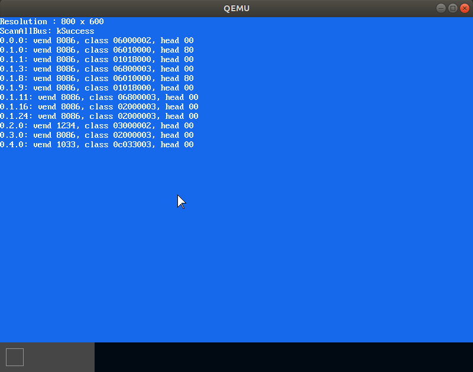

# MikanOS project
## Day 6A~B, 마우스 커서와 사각형 그리기 & PCI 장치 탐색
<br>

### 주요 개발 사항
1. 개행 처리가 가능한 콘솔 클래스 개발
2. PCI 장치를 재귀적으로 탐색하여 기록하는 `pci.cpp` 개발

<br>

### 핵심 동작 원리
1. 마우스 포인터와 데스트탑 UI
   - 마우스 포인터의 크기와 형태를 정의하고 픽셀 그리기를 통해 화면에 표시
   - 데스크탑 UI 느낌을 쉽게 표현하기 위해 사각형 그리기 함수 구현
     - 내부가 채워진 직사각형 그리기 함수 `FillRectangle`
     - 1픽셀 크기의 테두리를 그리는 함수 `DrawRectangle`

```cpp
...
void FillRectangle(PixelWriter& writer, const Vector2D<int>& pos,
        const Vector2D<int>& size, const PixelColor& c) {
    for (int dy = 0; dy < size.y; ++dy) {
        for (int dx = 0; dx < size.x; ++dx) {
            writer.Write(pos.x + dx, pos.y + dy, c);
        }
    }
}

void DrawRectangle(PixelWriter& writer, const Vector2D<int>& pos,
        const Vector2D<int>& size, const PixelColor& c) {
    for (int dy = 0; dy < size.y; ++dy) {
        writer.Write(pos.x, pos.y + dy, c);
        writer.Write(pos.x + size.x - 1, pos.y + dy, c);
    }
    for (int dx = 0; dx < size.x; ++dx) {
        writer.Write(pos.x + dx, pos.y, c);
        writer.Write(pos.x + dx, pos.y + size.y - 1, c);
    }
}
...
const int kMouseCursorWidth = 15;
const int kMouseCursorHeight = 24;
const char mouse_cursor_shape[kMouseCursorHeight][kMouseCursorWidth + 1] = {
  "@              ",
  "@@             ",
  "@.@            ",
  "@..@           ",
  "@...@          ",
  "@....@         ",
  "@.....@        ",
  "@......@       ",
  "@.......@      ",
  "@........@     ",
  "@.........@    ",
  "@..........@   ",
  "@...........@  ",
  "@............@ ",
  "@......@@@@@@@@",
  "@......@       ",
  "@....@@.@      ",
  "@...@ @.@      ",
  "@..@   @.@     ",
  "@.@    @.@     ",
  "@@      @.@    ",
  "@       @.@    ",
  "         @.@   ",
  "         @@@   ",
};
...
Vector2D<int> initial_mouse_pos{300, 300};
for (int dy = 0; dy < kMouseCursorHeight; ++dy) {
  for (int dx = 0; dx < kMouseCursorWidth; ++dx) {
    if (mouse_cursor_shape[dy][dx] == '@') {
      pixel_writer->Write(initial_mouse_pos.x + dx, initial_mouse_pos.y + dy, {0, 0, 0});
    }
    else if (mouse_cursor_shape[dy][dx] == '.') {
      pixel_writer->Write(initial_mouse_pos.x + dx, initial_mouse_pos.y + dy, {255, 255, 255});
    }
  }
}
```

<br>

2. PCI 버스의 계층적 구조
   - Peripheral Component Interconnect는 PC를 구성하는 다양한 컴포넌트와 시스템 사이의 인터페이스
     - 우리는 USB 호스트 드라이버를 구성하여 최종적으로 마우스 및 키보드 입력을 받는 것을 목표로 함
     - 여기서 USB 호스트 컨트롤러는 특별히 xHCI(USB 3.x)규격의 컨트롤러로 한정
     - xHCI에서 PCI 디바이스인 xHC를 초기화할 필요가 있음
   - PCI는 여러개의 버스와 디바이스들로 구성될 수 있음
     - 각 버스와 디바이스에는 번호가 부여됨
       - 디바이스는 시스템에 연결되어 상호작용하는 장치
       - 버스는 해당 장치가 연결된 통신선
     - 각 버스들은 부모 자식 관계가 있으며, [리눅스 커널](https://wiki.kldp.org/Translations/html/The_Linux_Kernel-KLDP/tlk6.html)에서는 업스트림 방향과 다운스트림 방향으로 칭함
       - 상위 버스, 업스트림 방향, 프라이머리 버스
       - 하위 버스, 다운스트림 방향, 세컨더리 버스
     - 버스와 버스는 서로 PCI-PCI 브릿지로 연결되어 있으며 (하위 버스가 PCI버스가 아닐 수도 있음 이때는 PCI-XXX 브릿지라고 부름) 브릿지 역시 디바이스임
     - 디바이스는 복수개의 펑션(기능)이 있음
     - 펑션에는 클래스(종류)가 있음


3. PCI Configuration Space를 활용한 장치 탐색
   - PCI는 CPU와 정보를 교환하기 위한 공유메모리를 가짐
     - PCI I/O
     - PCI Memory
     - PCI Configuration
   - 모든 PCI 장치는 PCI 설정 공간을 자신의 설정 정보를 표현하는 자료구조로 사용
   - PCI 설정 공간은 디바이스(PCI 슬롯) 마다 각자 다른 곳에 위치하고 있지만, 설정 헤더에 있는 상태 레지스터, 설정 레지스터를 이용해 시스템과 상호작용할 수 있음
     - CONFIG_ADDRESS register : `0x0CF8`
     - CONFIG_DATA register : `0x0CFC`
   - 사용자가 `CONFIG_ADDRESS`를 설정하면 `CONFIG_DATA`가 갱신되고, 표준에 따라 이를 해석하여 사용하는데, 아래와 같은 정보가 있을 수 있음
     - Device ID
     - Vendor ID
     - Status
     - Command
     - Base Class
     - Sub Class
     - Interface
     - 그 외...총 256bytes
   - 실제로 존재하고 접근가능한 디바이스는 반드시 0번 펑션을 갖고, 이를 조회하면 Vendor ID가  `0xFFFF`가 아님
     - 반면 접근할 수 없는 디바이스는 `0xFFFF`로 설정됨
   - 비트마스킹으로 특정 버스, 디바이스, 펑션 번호와 256byte의 설정공간을 표현하는 32비트 레지스터의 오프셋을 설정하는 `MakeAddress`함수 구현
   - 실제 레지스터에 값을 쓰거나 읽는 작업은 `asmfunc.asm`에 구현
   - `ReadVendorId`, `ReadDeviceId`, `ReadHeaderType` 등 `CONFIG_DATA`레지스터를 읽은 값을 파싱해주는 함수 구현
   - 호스트 브릿지(버스0, 디바이스0)을 시작으로 디바이스를 탐색하는 `ScanAllBus`
     - 호스트 브릿지의 접근가능한 모든 펑션은 그 번호가 모든 버스와 대응됨
   - 모든 버스에 대하여 장치를 찾는(그 장치의 0번 펑션이 접근가능한 경우에 '찾음') `ScanBus`
   - 모든 디바이스로부터 모든 펑션을 탐색하는 `ScanDevice`
   - 펑션을 정리하여 기록하고, 만약 펑션이 `PCI-PCI 브릿지`인경우 재귀적으로 이 과정을 반복하는 `ScanFunction`


```cpp
...
/**
 * @brief PCI Configuration Address를 조합하여 32비트 주소값을 만드는 함수
 * @return uint32_t 주소값
 * - 31 : Enable(1)
 * - 30:24 : 예약 공간(0)
 * - 23:16 : 버스 번호(0~255)
 * - 15:11 : 디바이스 번호(0~31)
 * - 10:8 : 펑션 번호(0~31)
 * - 7:0 : 4바이트 단위 PCI 설정공간 레지스터 오프셋(0x00~0xFF)
 */
uint32_t MakeAddress(uint8_t bus, uint8_t device, uint8_t function, uint8_t reg_addr) {...}

/**
 * @brief 주어진 버스로부터 각 디바이스를 찾는 함수
 * @param bus PCI 버스 번호, 호스트 브리지에 대해서 이 번호는 펑션 번호와 같음
 */
Error ScanBus(uint8_t bus) {...}

/**
 * @brief Vendor ID가 이미 검증된(이 함수 이후로는 검증하지 않는다) 주어진 펑션 및 설정정보로부터 찾은 디바이스를 저장함,
 * 만약 PCI-PCI 브릿지를 찾은 경우에는 재귀적으로 다운스트림 방향 버스(서브 버스) 탐색함
 */
Error ScanFunction(uint8_t bus, uint8_t device, uint8_t function) {...}

/**
 * @brief 0번 펑션에 대해 이미 검증된(이 함수 이후로는 검증하지 않는다) 주어진 디바이스의 모든 펑션(0을 포함하여)을 탐색함,
 * 0번 펑션이 아닌 모든 펑션에 대해서는 Vendor ID를 검증함
 */
Error ScanDevice(uint8_t bus, uint8_t device) {...}
...
```

<br>

### 주요 동작
`Makefile`에 새로운 `pci.o`와 `asmfunc.o`를 관찰하도록 하고 커널 빌드

```make
...
OBJS = main.o graphics.o font.o cp1251/cp1251.o newlib_support.o console.o pci.o asmfunc.o
...
%.o: %.asm Makefile
	nasm -f elf64 -o $@ $<
...
```

```
$ make
```

```
$ ./devenv/run_qemu.sh ./MikanLoaderX64/DEBUG_CLANG38/X64/Loader.efi ./kernel/kernel.elf
```

