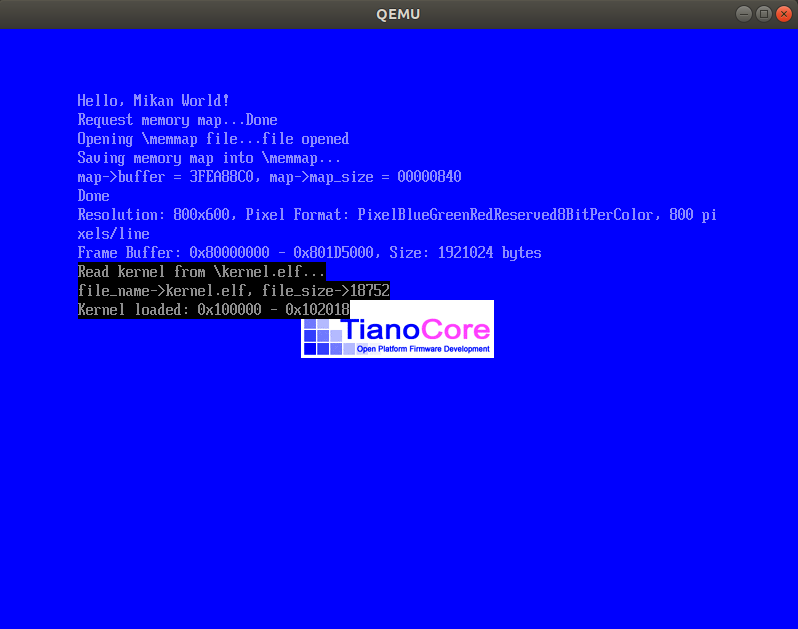

# MikanOS project
## Day 4C~D, 커널 픽셀 그리기 모듈화 및 부트로더 개량
<br>

### 주요 개발 사항
1. C++를 활용해 객체지향적으로 PixelWriter 작성
2. 커널 실행 파일 ELF에서 파일에서는 0크기의 할당되지 않는 영역(.bss)의 처리

<br>

### 핵심 동작 원리
1. `PixelWriter` 클래스와 그 자식클래스의 정의
   - `PixelWriter*`타입의 글로벌 변수 정의
   - `KernelMain`에서 부트로더로부터 전달받은 `FrameBufferConfig`의 `pixel_format`에 따라 서로 다른 자식 클래스 오브젝트 생성
     - `kPixelRGBResv8BitPerColor`인 경우 `class RGBResv8BitPerColorPixelWriter : public PixelWriter`
     - `kPixelBGRResv8BitPerColor`인 경우 `class BGRResv8BitPerColorPixelWriter : public PixelWriter`
     - 각각의 자식 클래스는 `virtual`메소드인 `Write`를 오버라이딩하고 있음
       - 즉, 상기의 각각의 경우에 서로다른 vtable이 주어짐
   - displacement `new`와 `delete`
     - `new`는 일반적인 시스템에서 해당 C++코드가 커널서비스를 통해 힙 영역에 동적할당하도록 설계되어있음
     - 하지만, 커널 빌드에서는 시스템이 동적할당 서비스를 제공하고 있지 않음
     - displacement `new`를 통해 명시된 영역에 (이번에서는 글로벌 변수 `pixel_writer_buf`) 오브젝트를 할당
       - `pixel_writer_buf`는 타입의 크기만큼 여유를 가져야함
       - `sizeof`는 vtable을 포함한 클래스의 크기를 알려줌

```cpp
class PixelWriter {
public:
...
  virtual void Write(int x, int y, const PixelColor& c) = 0;
...
};

class RGBResv8BitPerColorPixelWriter : public PixelWriter {
...
  virtual void Write(int x, int y, const PixelColor& c) override {
    auto p = PixelAt(x, y);
    p[0] = c.r;
    p[1] = c.g;
    p[2] = c.b;
  }
};

class BGRResv8BitPerColorPixelWriter : public PixelWriter {
...
  virtual void Write(int x, int y, const PixelColor& c) override {
    auto p = PixelAt(x, y);
    p[0] = c.b;
    p[1] = c.g;
    p[2] = c.r;
  }
};

...
// 메인에서
switch (frame_buffer_config.pixel_format) {
  case kPixelBGRResv8BitPerColor:
    pixel_writer = new(pixel_writer_buf)
      BGRResv8BitPerColorPixelWriter(frame_buffer_config);
    break;
  case kPixelRGBResv8BitPerColor:
    pixel_writer = new(pixel_writer_buf)
      RGBResv8BitPerColorPixelWriter(frame_buffer_config);
    break;
}
```

<br>

2. `elf.hpp`를 활용하여 ELF파일을 분석하여 커널 영역 할당
   - 이전의 방식은 읽어온 ELF파일을 그대로 베이스 주소에 쓰는 방식으로 로드함
     - 이 방식에서 실제 Readable 또는 Executable 세그먼트들이 그대로 파일로부터 불러짐
   - 하지만 Readable & Writable 섹션인 `.bss`는 파일에서의 크기가 0이고 메모리상에서만 크기를 가짐
     - 즉 파일을 그대로 로드하면 이 영역의 사용은 할당되지 않은 영역이거나 다른 영역을 침범하는 행위가 됨
   - 파일을 `kernel_buffer`로 읽고, 이것을 `Elf64_Ehdr*`에 대입하여 ELF구조체로 활용
     - `Elf64_Phdr`로부터 `PT_LOAD`세그먼트들의 가상 시작주소와 끝주소를 알아내는 `CalcLoadAddressRange`구현
       - 여기서 알아낸 가상주소 범위는 실제 세그먼트들이 필요로하는 주소범위의 크기와 같은 것
     - 위에서 알아낸 시작주소와 끝주소를 이용해 메모리 공간(`gBS->AllocatePages`)을 할당
     - 할당받은 공간에 `PT_LOAD`세그먼트들을 복사하면서, 추가적으로 필요한 공간을 0으로 초기화하는 `CopyLoadSegments`구현
     

```
$ readelf -l kernel.elf 

Elf file type is EXEC (Executable file)
Entry point 0x101020
There are 5 program headers, starting at offset 64

Program Headers:
  Type           Offset             VirtAddr           PhysAddr
                 FileSiz            MemSiz              Flags  Align
  PHDR           0x0000000000000040 0x0000000000100040 0x0000000000100040
                 0x0000000000000118 0x0000000000000118  R      0x8
  LOAD           0x0000000000000000 0x0000000000100000 0x0000000000100000
                 0x00000000000001a8 0x00000000000001a8  R      0x1000
  LOAD           0x0000000000001000 0x0000000000101000 0x0000000000101000
                 0x00000000000001b9 0x00000000000001b9  R E    0x1000
  LOAD           0x0000000000002000 0x0000000000102000 0x0000000000102000
                 0x0000000000000000 0x0000000000000018  RW     0x1000
  GNU_STACK      0x0000000000000000 0x0000000000000000 0x0000000000000000
                 0x0000000000000000 0x0000000000000000  RW     0x0

 Section to Segment mapping:
  Segment Sections...
   00     
   01     .rodata 
   02     .text 
   03     .bss 
   04     

```

```c
void CalcLoadAddressRange(Elf64_Ehdr* ehdr, UINT64* first, UINT64* last) {
  Elf64_Phdr* phdr = (Elf64_Phdr*)((UINT64)ehdr + ehdr->e_phoff);
  *first = MAX_INT64;
  *last = 0;
  for (Elf64_Half i = 0; i < ehdr->e_phnum; ++i) {
    if (phdr[i].p_type != PT_LOAD) continue;
    *first = MIN(*first, phdr[i].p_vaddr);
    *last = MAX(*last, phdr[i].p_vaddr + phdr[i].p_memsz);
  }
}

void CopyLoadSegments(Elf64_Ehdr* ehdr) {
  Elf64_Phdr* phdr = (Elf64_Phdr*)((UINT64)ehdr + ehdr->e_phoff);
  for (Elf64_Half i = 0; i < ehdr->e_phnum; ++i) {
    if (phdr[i].p_type != PT_LOAD) continue;

    UINT64 segm_in_file = (UINT64)ehdr + phdr[i].p_offset;
    CopyMem((VOID*)phdr[i].p_vaddr, (VOID*)segm_in_file, phdr[i].p_filesz);

    UINTN remain_bytes = phdr[i].p_memsz - phdr[i].p_filesz;
    SetMem((VOID*)(phdr[i].p_vaddr + phdr[i].p_filesz), remain_bytes, 0);
  }
}
...
// 메인에서
VOID* kernel_buffer;
status = gBS->AllocatePool(EfiLoaderData, kernel_file_size, &kernel_buffer);  // 버퍼 공간 할당
...
status = kernel_file->Read(kernel_file, &kernel_file_size, kernel_buffer);  // ELF파일을 그대로 읽기
...
Elf64_Ehdr* kernel_ehdr = (Elf64_Ehdr*)kernel_buffer;  // 파일을 구조체에 대입
UINT64 kernel_first_addr, kernel_last_addr;
CalcLoadAddressRange(kernel_ehdr, &kernel_first_addr, &kernel_last_addr);  // LOAD세그먼트 시작, 끝 주소 알아내기

UINTN num_pages = (kernel_last_addr - kernel_first_addr + 0xfff) / 0x1000;
status = gBS->AllocatePages(AllocateAddress, EfiLoaderData, num_pages, &kernel_first_addr);  // 실제 커널 로드 공간 할당

CopyLoadSegments(kernel_ehdr);  // 세그먼트 복사 및 추가공간 0 초기화
...
UINT64 entry_addr = *(UINT64*)(kernel_first_addr + 24);  // 첫번째 LOAD세그먼트의 가상 주소 시작점은 베이스 주소와 같음
```

<br>

### 주요 동작
`kernel/elf.hpp`는 이전에 `frame_buffer_config.hpp`와 같이 부드로더가 참조할 수 있게 심볼릭 링크로 구성해줘야한다.

```
$ ln -sf ../kernel/elf.hpp /home/isugyun/make-os/MikanLoaderPkg/
```

커널과 부드로더를 다시 빌드하여 실행할 수 있다.

```
$ make
```

```
$ ./devenv/loader_edkbuild.sh ./MikanLoaderPkg/ ./
$ ./devenv/run_qemu.sh ./MikanLoaderX64/DEBUG_CLANG38/X64/Loader.efi ./kernel/kernel.elf
```

- 커널 로드 전
  
- 커널 로드 후
  