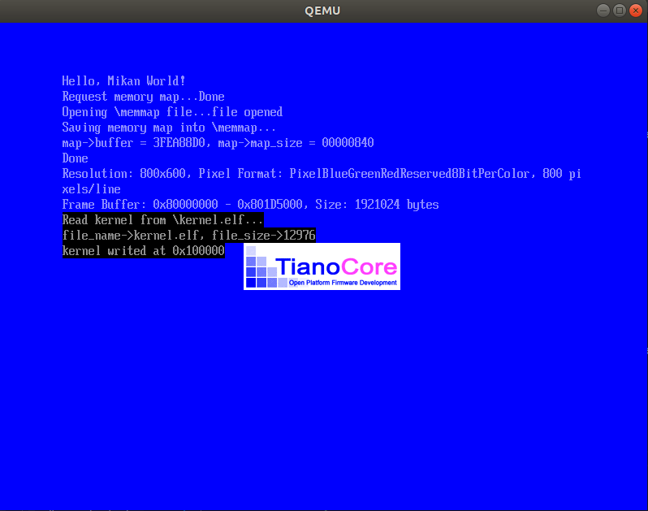
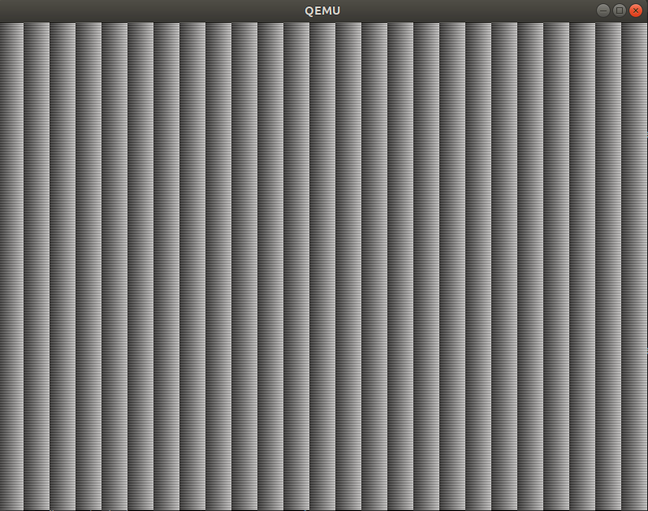

# MikanOS project
## Day 3B~C, 부트로더와 커널에서 픽셀 그리기
<br>

### 주요 개발 사항
1. 부트로더에서 UEFI GOP, Graphics Output Protocol를 통해 프레임 버퍼의 정보를 얻어오도록 수정
2. 부트로더에서 프레임 버퍼 내의 값을 수정하여 화면 색을 바꾸도록 수정
3. 얻어온 프레임 버퍼 위치와 크기정보를 커널로 전달하여 커널에서 픽셀을 그릴 수 있게 수정

<br>

### 핵심 동작 원리
1. GOP와 프레임 버퍼
   - RAM에서 비디오 디스플레이를 구동하는 비트맵을 표현하기 위한 자리를 프레임 버퍼라고 함
   - 프레임 버퍼에 값을 쓰면 디스플레이에 반영됨
   - GOP 프로토콜을 통해 UEFI의 비디오 드라이버와 통신

```c
gBS->OpenProtocol(
  gop_handles[0],
  &gEfiGraphicsOutputProtocolGuid,
  (VOID**)gop,
  image_handle,
  NULL,
  EFI_OPEN_PROTOCOL_BY_HANDLE_PROTOCOL
);

// 부트로더 메인에서
EFI_GRAPHICS_OUTPUT_PROTOCOL* gop;
  OpenGOP(image_handle, &gop);
  Print(
    L"Resolution: %ux%u, Pixel Format: %s, %u pixels/line\n",
    gop->Mode->Info->HorizontalResolution,
    gop->Mode->Info->VerticalResolution,
    GetPixelFormatUnicode(gop->Mode->Info->PixelFormat),
    gop->Mode->Info->PixelsPerScanLine
  );
  Print(
    L"Frame Buffer: 0x%0lx - 0x%0lx, Size: %lu bytes\n",
    gop->Mode->FrameBufferBase,
    gop->Mode->FrameBufferBase + gop->Mode->FrameBufferSize,
    gop->Mode->FrameBufferSize
  );
  UINT8* frame_buffer = (UINT8*)gop->Mode->FrameBufferBase;
  for (UINTN i = 0; i < gop->Mode->FrameBufferSize - 1024; i+=4) {
    frame_buffer[i] = 255;
  }
```

<br>

2. 커널에서 픽셀 그리기
   - 부트로더에서 GOP를 통해 가져온 프레임 버퍼 정보를 받을 수 있도록 `main.cpp`의 `KernelMain`에 파라미터를 수정
   - 부트로더에서 커널 엔트리를 호출할 때, 필요한 프레임 버퍼 베이스 주소와 크기를 전달
     - 전달한 파라미터는 `uint64_t`로 들어오는데, 그 중에서 `frame_buffer_base`는 8-bit array 타입으로 관리하면 각 픽셀 컬러를 다루기 쉬우므로 `reinterpret_cast`하여 사용

```cpp
// 커널
extern "C" void KernelMain(
        uint64_t frame_buffer_base, 
        uint64_t frame_buffer_size) {
    
    uint8_t* frame_buffer = reinterpret_cast<uint8_t*>(frame_buffer_base);
    for (uint64_t i = 0; i < frame_buffer_size; ++i) {
        frame_buffer[i] = i % 256;
    }
    while (1) 
        __asm__("hlt");
}
```
```c
// 부트로더에서
UINT64 entry_addr = *(UINT64*)(kernel_base_addr + 24);

typedef void EntryPointType(UINT64, UINT64);
EntryPointType* entry_point = (EntryPointType*)entry_addr;
entry_point(gop->Mode->FrameBufferBase, gop->Mode->FrameBufferSize);
```

<br>

### 주요 동작
커널을 빌드하기 위해서 새로 추가한 `cstdint`는 include path를 설정해줘야 사용할 수 있다. 따라서 `devenv/x86_64-elf`와 하위 디렉토리들을 컴파일러 옵션으로 넘겨줘야한다. 책에서는 이 과정을 환경변수로 설정하는 쉘 스크립트를 이용하지만, 어짜피 뒷장에서 make를 다루므로 인라인으로 작성하였다. 

```
$ clang++ -I../devenv/x86_64-elf/include/c++/v1 \
-I../devenv/x86_64-elf/include \
-I../devenv/x86_64-elf/include/freetype2 \
-I$HOME/MdePkg/Include \
-I$HOME/MdePkg/Include/X64 \
-nostdlibinc -D__ELF__ -D_LDBL_EQ_DBL -D_GNU_SOURCE -D_POSIX_TIMERS \
-DEFIAPI='__attribute__((ms_abi))' \
-O2 -Wall -g --target=x86_64-elf -ffreestanding -mno-red-zone -fno-exceptions -fno-rtti -std=c++17 -c main.cpp

$ ld.lld -L../devenv/x86_64-elf/lib \
--entry KernelMain -z norelro --image-base 0x100000 --static \
-o kernel.elf main.o
```

여기 사용된 플레그 중에서는 현재 빌드에 아무런 영향을 주지 않는 것들도 있지만, 일단 기록해둔다. 

```
$ ./devenv/loader_edkbuild.sh ./MikanLoaderPkg/ ./
...중략
$ ./devenv/run_qemu.sh ./MikanLoaderX64/DEBUG_CLANG38/X64/Loader.efi ./kernel/kernel.elf
```

- 커널 로드 전


- 커널 로드 후
