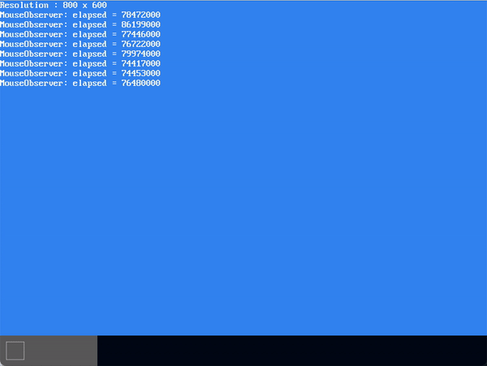

# MikanOS project
## Day 9B, 타이머를 활용한 성능측정
<br>

### 주요 개발 사항
1. 시간측정 기능 개발

<br>

### 핵심 동작 원리
1. Local APIC Timer를 이용하여 시간 측정
   - Local [APIC Timer](https://wiki.osdev.org/APIC_timer)는 다른 타이머와 마찬가지로 counter를 가짐
     - 단 외부 타이머가 비교적 느린 I/O 특성을 가지는 것에 비해 LAPIC 타이머는 CPU에 코어에 hardwired 되어 있음
       - 이것으로 인해 멀티코어 환경에서 각 코어에 대한 유일한 타이밍 소스로 사용되는 경우가 많음
       - 다만, 표준 주파수를 사용하고 있지 않아서 실제 시간단위(s, ms)로 측정은 불가능
   - 이것을 사용하기 위해서는 **카운터 초기값과 동작모드**를 설정함
     - LVT timer 레지스터 (`0xfee00320`)
       - 
       - 원-샷 모드로 설정 시 타이머가 0에 도달하면 작동을 멈춤
       - 주기 모드로 설정 시 타이머가 0에 도달하면 초기값을 다시 복사하여 수행
     - 카운터 초기값 : 감산카운터를 초기화하는 값 (`0xfee00380`)
     - 카운터 현재값 (`0xfee00390`)

```cpp
// timer.cpp
namespace {

const uint32_t kCountMax = 0xffffffffu;
volatile uint32_t &lvt_timer = *reinterpret_cast<uint32_t *>(0xfee00320);
volatile uint32_t &initial_count = *reinterpret_cast<uint32_t *>(0xfee00380);
volatile uint32_t &current_count = *reinterpret_cast<uint32_t *>(0xfee00390);
volatile uint32_t &divide_config = *reinterpret_cast<uint32_t *>(0xfee003e0);

} // namespace

void InitializeLAPICTimer() {
  divide_config = 0b1011;         // divide 1:1
  lvt_timer = (0b001 << 16) | 32; // masked, one-shot
}

// 가능한 최대 값으로 초기화함
void StartLAPICTimer() { initial_count = kCountMax; }
uint32_t LAPICTimerElapsed() { return kCountMax - current_count; }
void StopLAPICTimer() { initial_count = 0; }


// main.cpp
void MouseObserver(int8_t displacement_x, int8_t displacement_y) {
  layer_manager->MoveRelative(mouse_layer_id, {displacement_x, displacement_y});
  StartLAPICTimer();
  layer_manager->Draw();
  auto elapsed = LAPICTimerElapsed();
  StopLAPICTimer();
  printk("MouseObserver: elapsed = %u\n", elapsed);
}

...
InitializeLAPICTimer();
```


